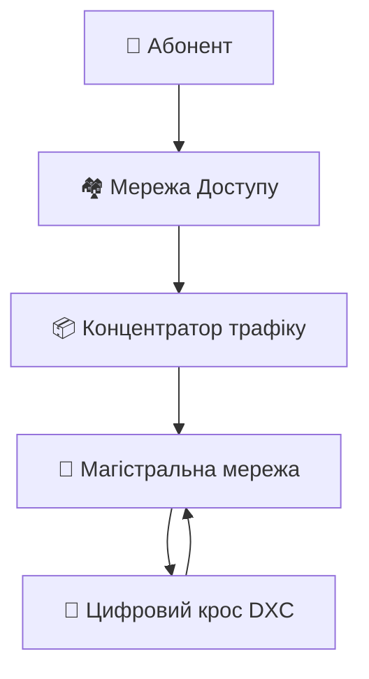

# 🌐 Telecommunication Optical Technologies: Student's Guide
> **Не просто конспект, а розбір польотів.**  
> Цей документ створено, щоб зрозуміти **як працює інтернет**, чому ми використовуємо саме такі стандарти і куди це все котиться. Без зайвої води, з історією та практичним сенсом.

---

## 📑 Зміст
1. [🏗 Архітектура мереж: Магістраль та Доступ](#1-архітектура-мереж-магістраль-та-доступ)
2. [🧵 Фізика світла: Оптичні волокна та стандарти](#2-фізика-світла-оптичні-волокна-та-стандарти)
3. [🕰 Еволюція передачі даних: Від PDH до WDM](#3-еволюція-передачі-даних-від-pdh-до-wdm)
4. [🎓 Шпаргалка для іспиту](#4-шпаргалка-для-іспиту)

---

## 1. 🏗 Архітектура мереж: Магістраль та Доступ

Уявіть транспортну систему країни. Є **швидкісні траси** (магістраль) і є **вулиці у вашому дворі** (доступ). Телекомунікації працюють так само.

### 🗺️ Структура мережі


*   **Магістральна мережа (Core):** 
    *   *Завдання:* Перевезти максимум даних між містами/країнами.
    *   *Технології:* SDH, DWDM, OTN.
    *   *Обладнання:* DXC (комутація), ADM (вставка/виділення каналів).
*   **Мережа доступу (Access):** 
    *   *Завдання:* Підключити конкретного користувача (вас).
    *   *Проблема:* Кожному користувачу виділяти окреме волокно — дорого.
    *   *Рішення:* **Концентрація трафіку**. 

### 🤔 Що таке концентрація трафіку?
> **Історичний факт:** У 80-х роках телефоністи помітили: приватний абонент говорить по телефону лише ~5 хвилин на годину. Решту часу лінія простоює.

*   **Як це працює:** 100 абонентів підключаються до концентратора, але на виході в місто йде лише 10 каналів.
*   **Економіка:** Це знижує вартість підключення для оператора (і для вас).
*   **Протокол V5:** "Мова", якою концентратор спілкується з телефонною станцією (АТС).
    *   `V5.1` — простий, без захисту (1 потік E1).
    *   `V5.2` — розумний, з захистом та концентрацією (до 16 потоків E1).

### 🛡️ Надійність (Resilience)
Якщо хтось перекопає кабель, інтернет не має зникати.
*   **Кільцева топологія (SDH Ring):** Сигнал йде в два боки. Якщо розрив — мережа миттєво перемикається на інший бік кільця (захисне перемикання).
*   **Dual Homing:** Підключення вузла доступу одразу до двох різних комутаторів.

---

## 2. 🧵 Фізика світла: Оптичні волокна та стандарти

Не всі волокна однакові. Вибір волокна залежить від того, **куди** і **як далеко** ви передаєте сигнал.

### 📏 Стандарти ITU-T (Головне, що треба знати)

| Стандарт | Назва | Для чого використовується | Фішка |
| :--- | :--- | :--- | :--- |
| **G.652** | Standard Single-Mode | 🌍 Універсальне (місто, доступ) | Найпоширеніше. Нуль дисперсії на 1310 нм. |
| **G.653** | Dispersion Shifted | 🚫 Застаріле для WDM | Нуль дисперсії на 1550 нм. Викликає нелінійні ефекти у WDM. |
| **G.654** | Cut-off Shifted | 🌊 Підводні кабелі | Дуже низьке загасання. Чистий кварц. |
| **G.655** | NZ-DSF | 🚀 Магістралі DWDM | Ненульова дисперсія. Ідеально для довгих дистанцій з підсилювачами. |
| **G.657** | Bend Insensitive | 🏠 FTTH (в квартирі) | **Не боїться вигинів.** Можна ховати за плінтусом (радіус вигину 7.5 мм). |

### 🌈 Кольори світла (Діапазони)
Оптичний зв'язок працює в інфрачервоному діапазоні (не видно очима).
```
O-band (1260-1360 нм) — Original (старий добрий 1310)
C-band (1530-1565 нм) — Conventional ⭐ (основний для WDM та підсилювачів EDFA)
L-band (1565-1625 нм) — Long (розширення ємності)
```
> **Чому саме 1550 нм?** Тому що саме на цій довжині хвилі працюють **оптичні підсилювачі (EDFA)**. Вони можуть підсилити сигнал без перетворення його назад в електрику.

### ⚡ Швидкості SDH (Синхронна цифрова ієрархія)
Це "етажність" швидкостей. Кожний наступний рівень кратний 4.
*   **STM-1:** 155 Мбіт/с (Базовий модуль)
*   **STM-4:** 622 Мбіт/с
*   **STM-16:** 2.5 Гбіт/с
*   **STM-64:** 10 Гбіт/с
*   **STM-256:** 40 Гбіт/с (Межа електроніки того часу)

---

## 3. 🕰 Еволюція передачі даних: Від PDH до WDM

Це найцікавіша частина. Чому ми змінили одні стандарти на інші?

### 🕰️ Ера PDH (Плезіохронна цифрова ієрархія)
*Час: 1960-1980-ті. Епоха мідних кабелів.*

**Історія зародження:**
Компанія **AT&T** у 60-х зіткнулася з проблемою: аналогові кабелі не тягнуть багато каналів. Вони винайшли **T1** — цифровий потік 1.544 Мбіт/с (24 голосових канали). Європа сказала: "Ні, у нас буде **E1** — 2.048 Мбіт/с (30 каналів)".
> **Наслідок:** Світ отримав 3 несумісні стандарти (США, Європа, Японія). З'єднати мережу США та Європи було головним болем інженерів.

**Як працювало мультиплексування (Bit Stuffing):**
Уявіть конвеєр. У вас є коробки різної швидкості. Щоб вони їхали рівно, ви підкладаєте під них **порожні картонки** (стафінг-біти), щоб вирівняти швидкість.
*   **Проблема:** Щоб дістати одну маленьку коробку (голосовий канал 64 кбіт/с) з великого контейнера (потік 140 Мбіт/с), треба **розібрати весь контейнер повністю**.
*   **Мінуси PDH:**
    1.  Неможливо легко виділити окремий канал.
    2.  Немає вбудованого контролю (якщо щось зламалося — дізнаєшся, коли клієнт зателефонує скаржитися).
    3.  Три різні стандарти.

### 🚀 Ера SDH/SONET (Синхронна цифрова ієрархія)
*Час: Кінець 80-х. Епоха оптики.*

**Рішення проблеми:**
Інженери сказали: "Давайте синхронізуємо всі годинники в мережі за одним стандартом (Stratum 1)".
*   **Перевага:** Тепер ми знаємо точно, де в потоці знаходиться кожен біт. Можна виділити канал 2 Мбіт/с з потоку 10 Гбіт/с **без розбору всього потоку**.
*   **Керування:** З'явилося вбудоване керування (TMN). Оператор бачить аварію на екрані за секунди.
*   **Захист:** Кільцева топологія з автоматичним відновленням (< 50 мс).

### 🌈 Ера WDM (Хвильове мультиплексування)
*Час: 1990-ті — сьогодення.*

**Проблема:** Швидкість електроніки впиралася в стелю (40 Гбіт/с). Як зробити швидше?
**Рішення:** Не прискорювати потік, а пустити **багато потоків одночасно різним кольором світла** по одному волокну.

*   **CWDM (Coarse):** 18 каналів, великий крок (20 нм). Дешево, для міст (до 70 км).
*   **DWDM (Dense):** 80-160 каналів, малий крок (0.8 нм). Дорого, для магістралей (тисячі км).

> **Аналогія:** 
> *   **PDH/SDH** — це кількість машин на одній смузі шосе.
> *   **WDM** — це додавання нових смуг на тому ж шосе без розширення дороги.

---

## 4. 🎓 Шпаргалка для іспиту

### 🔑 Ключові терміни
*   **ADM (Add-Drop Multiplexer):** Пристрій, що дозволяє "зняти" частину трафіку на проміжній станції, не зупиняючи весь потік.
*   **DXC (Digital Cross-Connect):** Цифрова телефонна станція для магістралей, комутує потоки між собою.
*   **PON (Passive Optical Network):** Оптоволокно до дому без активної електроніки на вулиці (тільки сплітери). Економія енергії та місця.
*   **Bit Stuffing (Біт-стафінг):** Метод вирівнювання швидкостей у PDH шляхом додавання "пустих" бітів. Головна причина складності PDH.

### ⚖️ Порівняння PDH vs SDH
| Характеристика | PDH (Старе) | SDH (Нове) |
| :--- | :--- | :--- |
| **Синхронізація** | Плезіохронна (різні годинники) | Синхронна (єдиний годинник) |
| **Доступ до каналів** | Повне демультиплексування | Прямий доступ (Add/Drop) |
| **Керування** | Майже відсутнє | Потужне вбудоване (OAM) |
| **Стандарти** | 3 різні (США, ЄС, Японія) | Єдиний світовий стандарт |
| **Макс. швидкість** | ~140 Мбіт/с | 40 Гбіт/с і вище (з WDM) |

### 📐 Цифри для запам'ятовування
1.  **E1** = 2048 кбіт/с (32 слоти, 30 для голосу).
2.  **STM-1** = 155 Мбіт/с.
3.  **G.652** = Звичайне волокно (1310 нм).
4.  **G.657** = Гнучке волокно (для квартир).
5.  **C-band** = 1530-1565 нм (найважливіший для підсилювачів).

---

## 💡 Чому це важливо знати сьогодні?
Навіть якщо ви працюєте з хмарами та 5G, фізичний рівень залишається тим самим.
1.  **Центри обробки даних (ЦОД):** Всереблі використовують оптику (DWDM) для зв'язку між серверами.
2.  **Інтернет речей (IoT):** Вимагає масової концентрації трафіку (принципи V5/PON).
3.  **Кібербезпека:** Розуміння фізичного рівня допомагає захистити канал від прослуховування (на рівні волокна).

> **Порада:** Не вчіть стандарти напам'ять. Розумійте **проблему**, яку вони вирішували. 
> *   PDH вирішував проблему аналогу -> цифра.
> *   SDH вирішував проблему керування та сумісності.
> *   WDM вирішував проблему ємності волокна.

---
