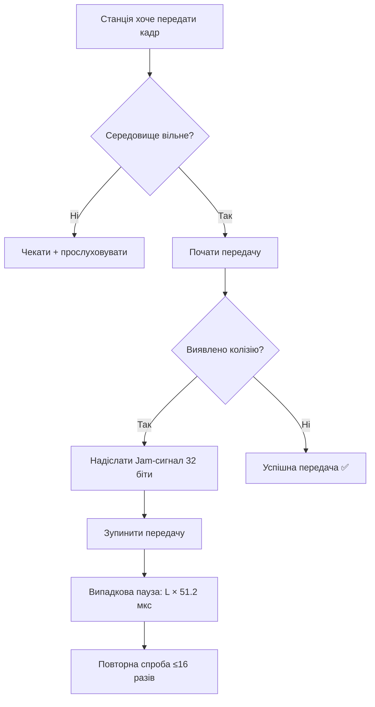

# Лекція 11: Технологія Ethernet (частина 1) — Заметки

> 📚 Конспект лекції з синхронізації в інфокомунікаційних мережах  
> 🗂 Тема: Технологія Ethernet  
> 📅 Дата: 2026

---

## 📋 Зміст

1. [Історія створення Ethernet](#1-історія-створення-ethernet)
2. [Адресація у мережах Ethernet](#2-адресація-у-мережах-ethernet)
3. [Метод доступу CSMA/CD](#3-метод-доступу-csmacd)
4. [Формати кадрів Ethernet](#4-формати-кадрів-ethernet)
5. [Специфікації фізичного середовища](#5-специфікації-фізичного-середовища-ethernet)
6. [Технологія Fast Ethernet](#6-технологія-fast-ethernet)

---

## 1. Історія створення Ethernet

### Ключові етапи розвитку

| Рік | Подія |
|-----|-------|
| 1960-ті | Розробка методів випадкового доступу Aloha (Гавайський університет) |
| 1975 | Xerox реалізує експериментальну мережу **Ethernet Network** |
| 1980 | DEC + Intel + Xerox публікують **Ethernet II (DIX)** для коаксіального кабелю |
| 1980-ті | На основі DIX розроблено стандарт **IEEE 802.3** |

### Порівняння Ethernet DIX та IEEE 802.3

```
Ethernet DIX (фірмовий):
• Об'єднані рівні MAC + LLC в єдиний канальний рівень
• Містить протокол Ethernet Configuration Test Protocol
• Формат кадру відрізняється від 802.3

IEEE 802.3 (стандартизований):
• Розділені рівні MAC та LLC
• Без протоколу тестування конфігурації
• Дещо інший формат кадру
• Часто називають "технологія 802.3"
```

> 💡 **Примітка**: Часто "Ethernet" без уточнень = Ethernet DIX, а "802.3" = стандартизована версія IEEE.

---

## 2. Адресація у мережах Ethernet

### MAC-адреса (6 байт / 48 біт)

```
Формат:
┌─────────────────┬─────────────────┐
│ Байти 6-4       │ Байти 3-1       │
│ Ідентифікатор   │ Індивідуальний  │
│ виробника (OUI) │ ідентифікатор   │
│                 │ пристрою        │
└─────────────────┴─────────────────┘

Приклад запису: 00-E0-14-00-00-00 (HEX, пари байтів через "-")
```

### Режими адресації

| Тип | Опис | Приклад використання |
|-----|------|---------------------|
| **Unicast** | Індивідуальна адреса (1→1) | Звичайна передача даних між двома вузлами |
| **Multicast** | Групова адреса (1→багато) | Відео/аудіо потоки, IPTV, конференції |
| **Broadcast** | Широкомовна адреса (1→всі) | `FF-FF-FF-FF-FF-FF` — ARP-запити, DHCP Discover |

> ⚠️ **Важливо**: Перший біт MAC-адреси визначає тип: `0` = Unicast, `1` = Multicast/Broadcast.

---

## 3. Метод доступу CSMA/CD

### Абревіатура
**CSMA/CD** = Carrier Sense Multiple Access with Collision Detection  
*(Множинний доступ з контролем несучої та виявленням колізій)*

### Алгоритм роботи (спрощено)



### Ключові параметри

| Параметр | Значення | Призначення |
|----------|----------|-------------|
| **Preable** | 7 байт `10101010` | Синхронізація приймача |
| **SFD** | 1 байт `10101011` | Початок кадру |
| **IPG** | 9.6 мкс | Міжпакетний інтервал (запобігає монополізації) |
| **Min Frame** | 64 байти | Гарантує виявлення колізій |
| **Max Frame** | 1518 байт | Обмеження розміру кадру |

### Умова надійного виявлення колізій

```
Tmin ≥ PDV

де:
• Tmin — час передачі кадру мінімальної довжини
• PDV (Path Delay Value) — час подвійного пробігу сигналу 
  (до найвіддаленішого вузла і назад)
```

> 🎯 **Висновок**: Мінімальний розмір кадру (64 байти) обрано так, щоб станція встигла виявити колізію ДО завершення передачі.

### Домен колізій (Collision Domain)

```
✅ Утворюють домен колізій:
• Хуби (repeaters)
• Коаксіальний сегмент

❌ Розділяють домени колізій:
• Мости (bridges)
• Комутатори (switches)
• Маршрутизатори (routers)
```

---

## 4. Формати кадрів Ethernet

### Порівняльна таблиця форматів

| Формат | Також відомий як | Поле після SA | Призначення |
|--------|-----------------|---------------|-------------|
| **802.3/LLC** | IEEE 802.3 + 802.2 | Length (2B) | Стандартний кадр з LLC-заголовком |
| **Raw 802.3** | Novell 802.3 | Length (2B) | NetWare/IPX без LLC |
| **Ethernet II** | DIX, Ethernet 2.0 | Type/EtherType (2B) | TCP/IP, сучасні мережі |
| **Ethernet SNAP** | 802.3 + SNAP | Length + SNAP header | Сумісність з EtherType + розширення |

### Структура кадру Ethernet II (найпоширеніший)

```
 0                   1                   2                   3
 0 1 2 3 4 5 6 7 8 9 0 1 2 3 4 5 6 7 8 9 0 1 2 3 4 5 6 7 8 9 0 1
+-+-+-+-+-+-+-+-+-+-+-+-+-+-+-+-+-+-+-+-+-+-+-+-+-+-+-+-+-+-+-+-+
| Preamble (7B) | SFD (1B)      | Destination MAC (6B)          |
+-+-+-+-+-+-+-+-+-+-+-+-+-+-+-+-+-+-+-+-+-+-+-+-+-+-+-+-+-+-+-+-+
| Source MAC (6B)               | EtherType (2B)  |               |
+-+-+-+-+-+-+-+-+-+-+-+-+-+-+-+-+-+-+-+-+-+-+-+-+ Data (46-1500B)|
|                                                               |
+                               +-+-+-+-+-+-+-+-+-+-+-+-+-+-+-+-+
|                               | FCS/CRC-32 (4B)               |
+-+-+-+-+-+-+-+-+-+-+-+-+-+-+-+-+-+-+-+-+-+-+-+-+-+-+-+-+-+-+-+-+
```

### Поле EtherType (приклади значень)

```
0x0800 — IPv4
0x0806 — ARP
0x86DD — IPv6
0x8100 — VLAN-tagged frame (802.1Q)
```

### LLC-заголовок (для кадрів 802.3/LLC)

```
┌────────┬────────┬────────┐
│ DSAP   │ SSAP   │ Control│
│ (1B)   │ (1B)   │ (1-2B) │
└────────┴────────┴────────┘

• DSAP: Destination Service Access Point
• SSAP: Source Service Access Point  
• Control: тип сервісу (без встановлення з'єднання / з підтвердженням / з встановленням)
```

### SNAP-розширення (для сумісності з Ethernet II)

```
Після LLC-заголовка додається:
┌─────────────────┬─────────────┐
│ OUI (3B)        │ Type (2B)   │
│ 00-00-00 = IEEE │ EtherType   │
└─────────────────┴─────────────┘
```

---

## 5. Специфікації фізичного середовища Ethernet

### Маркування стандартів: `XXBASE-YY`

```
XX — швидкість у Мбіт/с (10, 100, 1000)
BASE — базосмугова передача (на одній частоті)
YY — тип середовища:
  • T = twisted pair (вита пара)
  • F = fiber (оптоволокно)
  • 2/5 = коаксіал (тонкий/товстий)
```

### Сучасні стандарти (10/100/1000 Мбіт/с)

#### 🟢 Fast Ethernet (100 Мбіт/с)

| Стандарт | Середовище | Макс. довжина | Кодування | Примітки |
|----------|-----------|---------------|-----------|----------|
| **100BASE-TX** | 2 пари UTP Cat.5 | 100 м | 4B/5B + MLT-3 | Найпоширеніший |
| **100BASE-FX** | 2 волокна MMF | 400 м (полудуплекс) / 2 км (повний) | 4B/5B + NRZI | Магістралі |
| **100BASE-SX** | MMF, 850 нм | 2-10 км | — | Короткі дистанції |
| **100BASE-FX WDM** | 1 волокно SMF | До загасання | WDM | Парні інтерфейси: 1310/1550 нм |

#### 🔵 Gigabit Ethernet (1 Гбіт/с, оптика)

| Стандарт | Волокно | Довжина хвилі | Дальність |
|----------|---------|---------------|-----------|
| **1000BASE-SX** | MMF | 850 нм | до 550 м |
| **1000BASE-LX** | SMF/MMF | 1310 нм | 5 км (SMF) / 550 м (MMF) |
| **1000BASE-LH** | SMF | 1310/1550 нм | до 100 км |

> 📌 **Універсальність**: Метод CSMA/CD та часові параметри однакові для всіх фізичних специфікацій 10 Мбіт/с.

---

## 6. Технологія Fast Ethernet (IEEE 802.3u)

### Архітектура стека протоколів

```
┌─────────────────────────┐
│   LLC (IEEE 802.2)      │ ← Взаємодія з мережевими протоколами
├─────────────────────────┤
│   MAC (CSMA/CD)         │ ← Керування доступом до середовища
├─────────────────────────┤
│   MII / Reconciliation  │ ← Узгодження з фізичним рівнем
├─────────────────────────┤
│   PHY: PCS + PMA + PMD  │ ← Кодування, передача сигналу
├─────────────────────────┤
│   MDI (фізичний роз'єм) │ ← Кабель / оптика
└─────────────────────────┘
```

### Сервіси LLC (802.2)

1. **Тип 1** — Без встановлення з'єднання, без підтверджень  
   → Швидкий, але ненадійний (використовується з TCP/IP)

2. **Тип 2** — З встановленням з'єднання + підтвердження + контроль помилок  
   → Надійний, але повільний (NetBIOS, старі NetWare)

3. **Тип 3** — Без встановлення, але з підтвердженнями  
   → Компромісний варіант

### Автоузгодження (Auto-Negotiation)

```
Механізм дозволяє портам автоматично визначити:
• Швидкість: 10 / 100 Мбіт/с
• Дуплекс: напівдуплекс / повний дуплекс

🔄 Принцип: обмін FLP-імпульсами (Fast Link Pulse)
✅ Результат: вибір найвищого спільного режиму
```

### Середовище 100BASE-TX: деталі

```
Кабель:
• 2 пари UTP Cat.5 (або STP Type 1)
• 1 пара: TX, 1 пара: RX (окремі напрямки)

Роз'єм:
• RJ-45 (8P8C) для UTP
• DB-9 (екранований) для STP

Кодування:
• Логічне: 4B/5B (ефективність 80%)
• Фізичне: MLT-3 (знижує ВЧ-складові)
```

### Оптика 100BASE-FX: типи волокон

| Тип | Серцевина / Оболонка | Джерело світла | Довжина хвилі | Макс. відстань |
|-----|---------------------|----------------|---------------|----------------|
| **MMF** | 50/125 або 62.5/125 мкм | Світлодіод | 850 нм | 400 м (полудуплекс) / 2 км (повний) |
| **SMF** | 9-10/125 мкм | Лазер | 1310 нм | До 10-40 км (залежно від потужності) |

### Типи оптичних роз'ємів

```
• SC (Subscriber Connector) — ✅ рекомендований IEEE для 100BASE-FX
• ST (Straight Tip) — байонетне кріплення, застарілий
• MIC (Media Interface) — з FDDI, маркування A/B/M/S
• MT-RJ — дуплексний, компактний
```

---

## 🔑 Ключові висновки

1. **Ethernet** — еволюційна технологія: від DIX (1980) до сучасних 100 Гбіт/с.
2. **CSMA/CD** — фундаментальний механізм для напівдуплексних мереж; у повному дуплексі (сучасні комутатори) не використовується.
3. **Мінімальний кадр (64 байти)** — критичний параметр для гарантованого виявлення колізій.
4. **Ethernet II** — домінуючий формат кадрів у сучасних мережах (завдяки простоті та підтримці EtherType).
5. **Fast Ethernet** — зберегла сумісність з Ethernet на рівні кадрів та MAC, але оптимізувала фізичний рівень.
6. **Автоузгодження** — обов'язковий механізм для гнучкого підключення різного обладнання.

---

## 📚 Додаткові ресурси

- [IEEE 802.3 Standard](https://standards.ieee.org/ieee/802.3/7466/)
- [Wireshark: Ethernet Frame Dissection](https://wiki.wireshark.org/Ethernet)
- [Cisco: Ethernet Technologies Overview](https://www.cisco.com/c/en/us/support/docs/lan-switching/ethernet/17065-2.html)

---

> 🛠️ **Практична порада**: При аналізі трафіку у Wireshark звертайте увагу на поле `EtherType` — воно одразу покаже, який протокол вище (IP, ARP, VLAN тощо).
