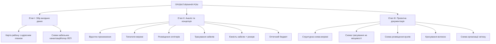
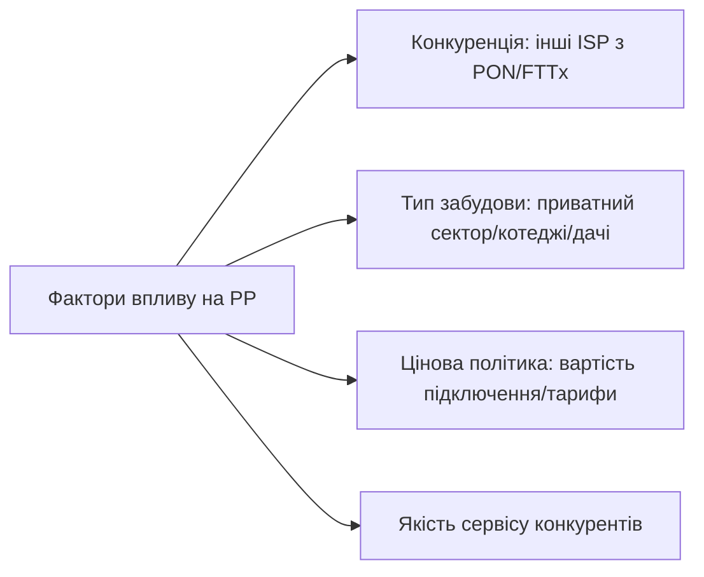
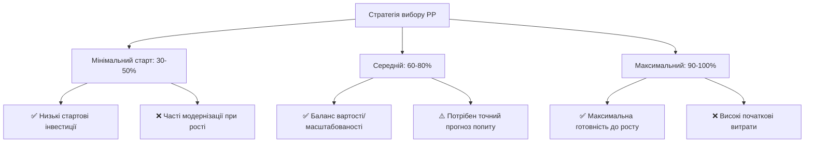
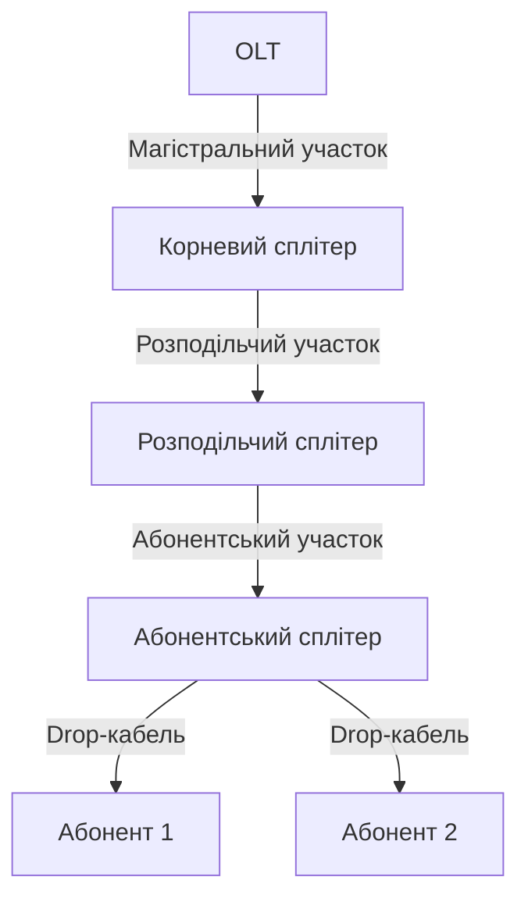
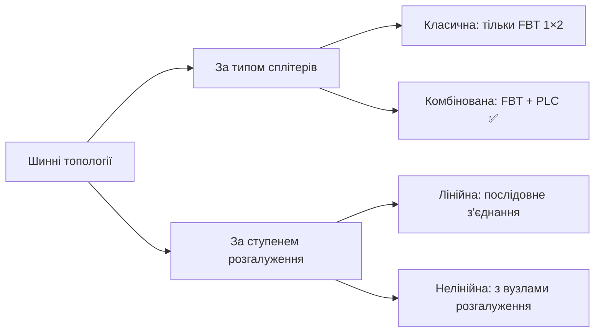
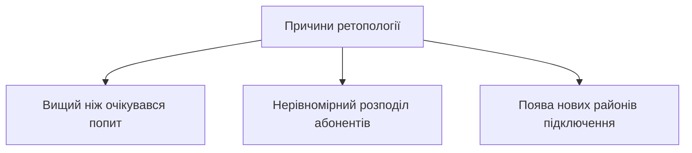
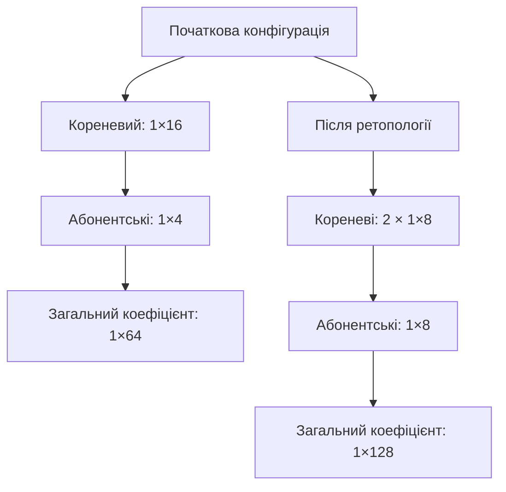
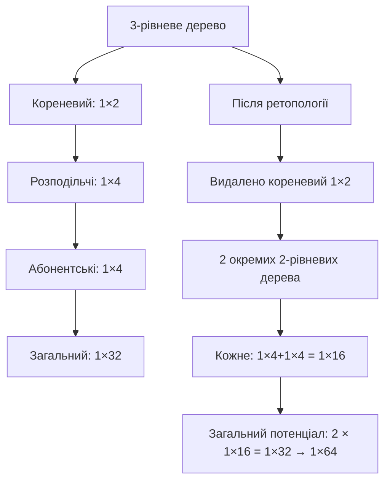

# 📚 Лекція 15: Проектування пасивних оптичних мереж (PON)

> **Тема:** Етапи проектування, топології, розрахунок бюджету, ретопологія  
> **Мова:** Українська  
> **Дата створення:** `2026-05-18`  
> **Попередня частина:** [Лекція 14](./Lecture14_Optical_Access_Part2.md)

---

## 📋 Зміст

1. [Етапи проектування PON](#151-етапи-проектування-pon)
2. [Збір вихідних даних](#152-збір-вихідних-даних)
3. [Відсоток проникнення](#153-відсоток-проникнення)
4. [Вибір топології мережі](#154-вибір-топології-мережі)
5. [Ретопологія та масштабування](#155-ретопологія-та-масштабування)
6. [Практичні розрахунки та інструменти](#156-практичні-розрахунки-та-інструменти)

---

## 15.1 Етапи проектування PON

### 🔹 Загальний алгоритм розробки проекту



> 💡 **Ключова мета проектування PON**: мінімізувати сумарне затухання сигналу при максимальній ефективності використання ресурсів.

---

## 15.2 Збір вихідних даних

### 🔹 Необхідні документи та інформація

| Документ | Джерело отримання | Призначення |
|----------|-------------------|-------------|
| 🗺️ Карта району з адресним планом | Місцеві адміністративні органи | Визначення розташування абонентів |
| 📐 Схеми кабельних каналізацій | Експлуатаційні служби, БТІ | Планування прокладки кабелю |
| ⚡ Схеми опор ЛЕП | Енергопостачальні компанії | Використання існуючої інфраструктури |
| 🏠 Дані про тип забудови | Реєстри, обходи території | Оцінка щільності абонентів |

### 🔹 Обмеження супутникових знімків (Google Maps, Яндекс.Карти)

```yaml
⚠️ Недоліки використання супутникових знімків:
  • Рідке оновлення (особливо для сіл/ПГТ)
  • Відсутність позначень будинків та доріг
  • Неможливість визначення схеми комунікацій
  • Ризик невідповідності актуальному стану місцевості

✅ Рекомендація:
  • Обов'язковий об'їзд території (інженерні вишукування)
  • Верифікація даних "на землі" перед початком проектування
```

---

## 15.3 Відсоток проникнення

### 🔹 Визначення та фактори впливу

> **Відсоток проникнення (PP — Percent of Penetration)** — частка потенційних абонентів, готових підключитися до мережі.



### 🔹 Орієнтовні значення відсотка проникнення

| Тип забудови | Орієнтовний PP | Особливості |
|--------------|----------------|-------------|
| 🏡 Приватний сектор (без конкурентів) | **40-60%** | Стабільний попит протягом року |
| 🏕️ Дачні кооперативи | **20-30%** | Сезонна залежність, низька щільність |
| 🏘️ Котеджні селища | **80-100%** | Високий дохід абонентів, вимоги до якості |

### 🔹 Зв'язок відсотка проникнення з портами OLT

> ⚠️ **Важливо**: У PON масштабування відбувається кратно степеням двійки (`2ⁿ`) через конструкцію сплітерів.

#### 📊 Приклад розрахунку №1 (класичний)

```yaml
Вхідні дані:
  • Селище: 340 будинків
  • Цільовий охоплення: 50% = 170 абонентів
  • OLT: коефіцієнт розгалуження 1:64

Розрахунок:
  • Портів OLT потрібно: ⌈170 ÷ 64⌉ = 3 порти
  • Фактична ємність 3 портів: 3 × 64 = 192 абоненти
  • Реальний % проникнення: 192 ÷ 340 = 56.5%
  
Оптимізація:
  • Використання 4-го порту: 4 × 64 = 256 абонентів
  • Новий % проникнення: 256 ÷ 340 = 75.3%
  • Резерв для майбутнього розширення: ✅
```

#### 📊 Приклад розрахунку №2 (сучасний, GPON 1:128)

```yaml
Вхідні дані:
  • Селище: 1000 будинків
  • Цільовий охоплення: 50% = 500 абонентів
  • OLT: 8 портів, коефіцієнт 1:128 (наприклад, ZXA10 C320)

Розрахунок:
  • Портів потрібно: ⌈500 ÷ 128⌉ = 4 порти
  • Ємність 4 портів: 4 × 128 = 512 абонентів
  • Реальний % проникнення: 512 ÷ 1000 = 51.2%
  
Масштабування:
  • Вільні порти: 4 → резерв на 512 додаткових абонентів
  • Максимальний потенціал: 100% охоплення без заміни OLT
```

### 🔹 Стратегії вибору відсотка проникнення



> 💡 **Рекомендація**: Більшість провайдерів обирають стратегію **поетапного масштабування** з початковим PP 40-60% та закладеним резервом для подвоєння ємності.

---

## 15.4 Вибір топології мережі

### 🔹 Основні топології PON

```mermaid
graph LR
    A[Топології PON] --> B[🌳 Дерево (Tree)]
    A --> C[🚌 Шина (Bus)]
    A --> D[⭐ Зірка (Star)]
    
    B --> B1[Найпопулярніша, гнучка, масштабована]
    C --> C1[Економія волокон, для довгих вулиць]
    D --> D2[Рідко використовується в PON]
```

### 🔹 Древовидна топологія: термінологія



| Термін | Визначення | Приклад |
|--------|------------|---------|
| **Абонентський сплітер** | Останній сплітер у каскаді, до якого підключаються абоненти | PLC 1×4, 1×8, 1×16 |
| **Корневий сплітер** | Перший сплітер у каскаді, підключений безпосередньо до OLT | PLC 1×4, 1×8, 1×16 |
| **Розподільчий сплітер** | Проміжний сплітер між кореневим та абонентськими | PLC 1×2, 1×4 |
| **Магістральний участок** | Відрізок між OLT та кореневим сплітером | Волоконність: 1-8 |
| **Розподільчий участок** | Відрізок між кореневим та абонентськими сплітерами | Волоконність: змінна |
| **Абонентський участок** | Відрізок між абонентським сплітером та будинком | Зазвичай 1 волокно (drop-кабель) |

### 🔹 Рівні каскадування сплітерів

```yaml
Позначення каскадів:
  • "1×4+1×16" = 2-рівневе дерево: кореневий 1×4 + абонентські 1×16
  • "1×2+1×4+1×8" = 3-рівневе дерево: три рівні каскадування

Типові конфігурації:
  ✅ 1-рівневі: 1×32, 1×64 (прості, але менш гнучкі)
  ✅ 2-рівневі: 1×4+1×16, 1×8+1×8, 1×16+1×4 (найпопулярніші)
  ⚠️ 3-рівневі: 1×2+1×4+1×8 (для економії волокон)
  ❌ 4+ рівні: не рекомендуються (високі втрати, складність)
```

### 🔹 Критерії вибору ємності абонентських сплітерів

#### Критерій 1: Швидкість будівництва мережі

```mermaid
graph LR
    A[Мета: швидке розгортання] --> B[Велика ємність абонентських сплітерів]
    B --> C[Приклад: топологія "1×4+1×16"]
    C --> D[Переваги: мінімум сплітерів, кабелю, монтажу]
    C --> E[Недоліки: великі відстані до абонентів, повільне підключення]
```

**Приклад розрахунку для 128 будинків:**
```yaml
Топологія: "1×4+1×16" (2-рівнева)
  • Абонентські сплітери: 8 × 1×16 = 8 шт.
  • Кореневі сплітери: 2 × 1×4 = 2 шт.
  • Всього сплітерів: 10 шт.
  • Волоконність магістралі: мінімальна
  
✅ Плюс: Швидке розгортання, низькі витрати на "пасивку"
❌ Мінус: Відстані до абонентів 200-300м → повільне підключення
```

#### Критерій 2: Швидкість підключення абонентів

```mermaid
graph LR
    A[Мета: швидке підключення клієнтів] --> B[Мала ємність абонентських сплітерів]
    B --> C[Приклад: топологія "1×16+1×4"]
    C --> D[Переваги: абоненти близько до сплітерів, швидкий монтаж]
    C --> E[Недоліки: більше сплітерів, кабелю, складніша інфраструктура]
```

**Приклад розрахунку для 128 будинків:**
```yaml
Топологія: "1×16+1×4" (2-рівнева)
  • Абонентські сплітери: 32 × 1×4 = 32 шт.
  • Кореневі сплітери: 2 × 1×16 = 2 шт.
  • Всього сплітерів: 34 шт.
  • Волоконність розподільчого кабелю: вища
  
✅ Плюс: Підключення за 1-2 години, drop-кабелі 50-100м
❌ Мінус: Вищі витрати на етапі будівництва
```

#### 🎯 Компромісне рішення

```yaml
Оптимальна топологія для більшості провайдерів: "1×8+1×8"

Баланс переваг:
  • Помірна кількість сплітерів (~18-20 шт. на 128 абонентів)
  • Розумні відстані до абонентів (100-150м)
  • Гнучкість масштабування
  • Прийнятний оптичний бюджет
  
📊 Статистика: ~80% провайдерів обирають саме цю конфігурацію
```

### 🔹 Вибір кількості рівнів каскадування

#### Коли використовувати 3-рівневе дерево?

```mermaid
graph TD
    A[Потреба в 3-рівневому дереві] --> B[Жорстка економія волокон]
    B --> C[Приклад: наявність тільки 4-волоконного кабелю]
    C --> D[Рішення: "1×4+1×4+1×4" замість "1×16+1×4"]
```

**Порівняння волоконності:**

| Конфігурація | Макс. волокон на ділянці | Економія | Недоліки |
|--------------|--------------------------|----------|----------|
| **2-рівнева "1×16+1×4"** | До 12 волокон | — | Потребує товстішого кабелю |
| **3-рівнева "1×4+1×4+1×4"** | Макс. 4 волокна | ✅ До 3× менше кабелю | ❌ Складність, втрати |

#### ⚠️ Чому не рекомендуються 3+ каскади?

```yaml
Недоліки багаторівневих схем:
  • 🔧 Складність трасування та кросування
  • 🔢 Збільшення кількості сплітерів та вузлів
  • 🔍 Ускладнення пошуку несправностей
  • 📉 Погіршення SNR та ORL через додаткові з'єднання
  • ⚡ Збільшення оптичних втрат:
    - Сплітер 1×16: ~13.6 дБ
    - Каскад 1×4+1×4: ~14 дБ (гірше!)
    - Додаткові зварювання/конектори: +0.1-0.5 дБ кожен

✅ Висновок: Використовувати 3 каскади тільки при критичній економії волокон
```

### 🔹 Шинна топологія

#### Класифікація шинних топологій



#### Конфігурація комбінованої шини

```yaml
Принцип побудови:
  • Магістраль: каскад нерівноплечих FBT-сплітерів 1×2
  • Відводи: до виходу з більшим затуханням підключається PLC-сплітер
  • Абоненти: підключаються до виходів PLC

Позначення: "8FBT+1×8"
  • 8 = кількість FBT-вузлів у каскаді
  • 1×8 = ємність абонентських PLC-сплітерів
  • У 7 вузлах: FBT + PLC, у останньому: тільки PLC
```

#### Коли обирати шинну топологію?

```yaml
✅ Доцільно використовувати, коли:
  • Довга пряма вулиця (1-3 км) без відгалужень
  • Критична економія волокон (1 волокно на більшості ділянок)
  • Вже прокладений кабель недостатньої волоконності для дерева

❌ Не рекомендується, коли:
  • Щільна квадратна забудова
  • Очікується швидке масштабування
  • Важлива простота діагностики несправностей
```

#### Недоліки шинної топології

| Недолік | Наслідок |
|---------|----------|
| 🔁 Погана масштабованість | Важко збільшити абонентську базу |
| 🔍 Складна діагностика | Пошук "засвіту" вимагає перевірки всіх вузлів |
| ⚡ Нерівномірні втрати | Абоненти в кінці шини отримують слабший сигнал |
| 🔧 Складність монтажу | Послідовне з'єднання вимагає точності |

---

## 15.5 Ретопологія та масштабування

### 🔹 Що таке ретопологія?

> **Ретопологія** — процес зміни топології мережі для збільшення абонентської бази без повної перебудови інфраструктури.



### 🔹 Проблема заповнення сплітерів

```yaml
Сценарій проблеми:
  • Поселок: 512 будинків, ціль: 50% = 256 абонентів
  • OLT: 4 порти × 64 = 256 максимальних підключень
  • Топологія: "1×16+1×4" та "1×2+1×8+1×4"

Ситуація через 2 місяці:
  • Деякі сплітери 1×4 заповнені на 100%
  • Інші сплітери 1×4 — порожні
  • Нові заявки в "заповнених" секторах → неможливо підключити

Рішення №1 (просте):
  • Заміна абонентського сплітера 1×4 → 1×8
  • ⚠️ Увага: загальний коефіцієнт стає 1×128!
  • ⚠️ Ризик: перевищення оптичного бюджету (>30 дБ)
  • ✅ Вимога: потужність на ONU ≥ -26 дБм
```

### 🔹 Метод "Розвідка будівництва"

```mermaid
graph LR
    A[Метод "Розвідка будівництва"] --> B[Початкове ділення на 128]
    B --> C[Топології: "1×16+1×8", "1×2+1×8+1×8"]
    C --> D[Фактично підключено: ≤64 на порт]
    C --> E[Резерв: можливість підключення ще 64]
    
    D --> F[✅ Гнучкість підключення]
    E --> G[⚠️ Ризик оптичного бюджету]
```

> 💡 **Застосування**: Для провайдерів з обмеженим стартовим бюджетом, але з прогнозом високого попиту.

### 🔹 Масштабування методом подвоєння

#### Варіант 1: Заміна кореневого сплітера



**Етапи впровадження:**
```yaml
Етап 1: Заміна кореневого сплітера
  • 1×16 → 2 × 1×8
  • Вимагає: 1 додатковий порт OLT (або новий OLT)
  • Перевага: мінімум робіт "в полі"

Етап 2: Заміна абонентських сплітерів (за потребою)
  • 1×4 → 1×8 (тільки в заповнених секторах)
  • Перевага: поступове впровадження, мінімум простоїв
```

#### Варіант 2: Видалення кореневого сплітера 1×2



> ✅ **Перевага**: Кореневий сплітер 1×2 в серверній → швидка "розв'язка" дерев без виїзду на об'єкт.

### 🔹 Порівняння ретопології: Дерево vs Шина

| Критерій | 🌳 Дерево | 🚌 Шина |
|----------|-----------|---------|
| **Швидкість масштабування** | ✅ Швидка (заміна 1-2 сплітерів) | ❌ Повільна (заміна каскаду FBT) |
| **Обсяг монтажних робіт** | ✅ Мінімальний | ❌ Значний (перетрасування) |
| **Потреба в резервних волокнах** | ✅ Тільки на магістралі | ❌ По всій довжині шини |
| **Вплив на існуючих абонентів** | ✅ Мінімальний | ⚠️ Можливі перерви |
| **Гнучкість** | ✅ Висока | ❌ Низька |

```mermaid
graph LR
    A[Ретопологія шини "16FBT+1×4" → 2×"8FBT+1×8"] --> B[Етап 1: Заміна 8 з 16 FBT-сплітерів]
    B --> C[Етап 2: Прокладка резервного волокна через половину території]
    C --> D[Етап 3: Заміна абонентських PLC 1×4 → 1×8]
    D --> E[Загальний час: 3-5× більше, ніж для дерева]
```

---

## 15.6 Практичні розрахунки та інструменти

### 🔹 Розрахунок оптичного бюджету

```yaml
Формула загальних втрат:
  Total_Loss = L_fiber + L_splitter + L_connectors + L_splices + L_margin

Де:
  • L_fiber = α × L (α = 0.35 дБ/км @1310нм, 0.22 дБ/км @1550нм)
  • L_splitter = затухання сплітера (див. таблицю нижче)
  • L_connectors = 0.2-0.5 дБ на з'єднання
  • L_splices = 0.05-0.1 дБ на зварювання
  • L_margin = 3-5 дБ (запас на деградацію)

Оптичний бюджет класів (ITU G.982):
  • Клас A: 5-20 дБ
  • Клас B: 10-25 дБ  
  • Клас C: 15-30 дБ ✅ (найпоширеніший для GPON)
```

#### Затухання сплітерів (орієнтовні значення)

| Сплітер | Теоретичне, дБ | Практичне, дБ |
|---------|----------------|---------------|
| 1×2 | 3.0 | 3.5-4.0 |
| 1×4 | 6.0 | 7.0-7.5 |
| 1×8 | 9.0 | 10.0-10.5 |
| 1×16 | 12.0 | 13.5-14.0 |
| 1×32 | 15.0 | 16.5-17.5 |
| 1×64 | 18.0 | 20.0-21.0 |
| 1×128 | 21.0 | 23.0-24.0 |

> ⚠️ **Правило**: Каскад сплітерів має БОЛЬШЕ затухання, ніж один еквівалентний:
> - 1×16: ~13.6 дБ
> - 1×4 + 1×4: ~7.2 + 7.2 = 14.4 дБ ❌

### 🔹 Калькулятор проектування (псевдокод)

```python
# Псевдокод для оцінки параметрів PON-мережі

def calculate_pon_budget(
    fiber_length_km, 
    splitter_cascade,  # наприклад [4, 16] для "1×4+1×16"
    connectors_count,
    splices_count,
    wavelength_nm=1490  # 1310 для uplink, 1490/1550 для downlink
):
    # Параметри волокна
    alpha = 0.22 if wavelength_nm >= 1490 else 0.35  # дБ/км
    
    # Затухання у волокні
    loss_fiber = alpha * fiber_length_km
    
    # Затухання сплітерів (практичні значення)
    splitter_losses = {2: 3.8, 4: 7.3, 8: 10.3, 16: 13.8, 32: 17.0, 64: 20.5}
    loss_splitters = sum(splitter_losses[n] for n in splitter_cascade)
    
    # З'єднання та зварювання
    loss_connectors = 0.3 * connectors_count
    loss_splices = 0.08 * splices_count
    
    # Запас
    margin = 3.0
    
    total_loss = loss_fiber + loss_splitters + loss_connectors + loss_splices + margin
    
    return {
        'total_loss_dB': round(total_loss, 2),
        'within_budget': total_loss <= 28,  # для класу C з запасом
        'components': {
            'fiber': round(loss_fiber, 2),
            'splitters': round(loss_splitters, 2),
            'connectors': round(loss_connectors, 2),
            'splices': round(loss_splices, 2),
            'margin': margin
        }
    }

# Приклад використання
result = calculate_pon_budget(
    fiber_length_km=15,
    splitter_cascade=[4, 16],  # топологія "1×4+1×16"
    connectors_count=6,
    splices_count=12
)
print(f"Загальні втрати: {result['total_loss_dB']} дБ")
print(f"В межах бюджету: {result['within_budget']}")
```

### 🔹 Чек-лист проектування PON

```markdown
## ✅ Етап I: Збір даних
- [ ] Отримано карту з адресним планом
- [ ] Схеми комунікацій (кабельні каналізації/опори)
- [ ] Проведено об'їзд території (інженерні вишукування)
- [ ] Визначено тип забудови та щільність абонентів

## ✅ Етап II: Концепція
- [ ] Визначено цільовий % проникнення (з резервом)
- [ ] Обрано топологію (дерево/шина) та рівень каскадування
- [ ] Розраховано ємність кабелів з резервом волокон
- [ ] Проведено розрахунок оптичного бюджету (≤28 дБ для класу C)
- [ ] Визначено місця розміщення сплітерів (температурний режим ≥ -5°C)

## ✅ Етап III: Документація
- [ ] Структурна схема мережі (OLT → сплітери → ONU)
- [ ] Трасування кабелів на карті (з прив'язкою до об'єктів)
- [ ] Схеми кросування в оптичних вузлах
- [ ] Специфікація обладнання та матеріалів
- [ ] Кошторис робіт та терміни виконання
```

---

## 📎 Додатки

### 🔗 Корисні стандарти та документи

```yaml
ITU-T:
  G.982: Загальні характеристики пасивних оптичних мереж
  G.983.1–.5: Специфікації BPON (архітектура, управління)
  G.984.1–.4: Специфікації GPON (фізичний рівень, GTC, OMCI)
  G.652: Характеристики одномодового волокна
  G.671: Характеристики пасивних оптичних компонентів

Рекомендації з проектування:
  • FSAN Deployment Guidelines
  • IEEE 802.3ah (EPON) — розділи з фізичного рівня
  • Локальні будівельні норми (прокладка кабелів, заземлення)
```

### 🔑 Ключові терміни

| Термін | Розшифровка | Опис |
|--------|-------------|------|
| **PP** | Percent of Penetration | Відсоток потенційних абонентів, готових до підключення |
| **ODN** | Optical Distribution Network | Пасивна оптична розподільча мережа (від OLT до ONU) |
| **PLC** | Planar Lightwave Circuit | Технологія виготовлення сплітерів з рівномірним затуханням |
| **FBT** | Fused Biconic Taper | Технологія сплітерів з нерівномірним затуханням (для шин) |
| **Drop-кабель** | — | Оптоволоконний кабель для підключення останніх метрів до абонента |
| **Ретопологія** | — | Зміна топології мережі для масштабування без повної перебудови |
| **SNR** | Signal-to-Noise Ratio | Співвідношення сигнал/шум, дБ (чим більше, тим краще) |
| **ORL** | Optical Return Loss | Втрати на відбиття, дБ (чим більше, тим менше відбиттів) |

### 🛠️ Інструменти для проектування

```yaml
Програмне забезпечення:
  • QGIS / ArcGIS: робота з геопросторовими даними
  • AutoCAD / NanoCAD: креслення схем та планів
  • PON Planner (вендорські): розрахунок бюджету, трасування
  • Excel / Google Sheets: таблиці розрахунків, специфікації

Обладнання для вишукувань:
  • GPS-трекер: точна прив'язка об'єктів
  • Лазерний далекомір: вимірювання відстаней
  • Оптичний рефлектометр (OTDR): перевірка існуючих ліній
  • Вимірювач потужності: оцінка втрат на об'єкті
```

---

> 💾 **Збережено для GitHub**  
> Файл: `Lecture15_PON_Design.md`  
> Формат: Markdown + Mermaid (для діаграм)  
> Сумісність: GitHub, GitLab, VS Code, Obsidian, Typora

```bash
# Команди для завантаження в репозиторій:
git add Lecture15_PON_Design.md
git commit -m "docs: add Lecture 15 notes - PON Network Design"
git push origin main

# Оновлення навігації в README.md:
echo "- [Лекція 15: Проектування PON](./Lecture15_PON_Design.md)" >> README.md
```

✅ **Серія лекцій з оптичних технологій завершена!**  

---

> 🎓 **Підсумок курсу "Оптичні технології на мережі доступу"**:
> 
> | Лекція | Тема | Ключові навички |
> |--------|------|----------------|
> | 13 | Введення в FTTx, PON | Розуміння архітектури, компонентів, класів втрат |
> | 14 | Порівняння GPON/EPON, WDM-PON | Вибір технології, розуміння еволюції стандартів |
> | 15 | Проектування PON | Розрахунок бюджету, вибір топології, стратегії масштабування |
> 
> 🔧 **Практичний результат**: Здатність самостійно спроектувати PON-мережу для приватного сектора/багатоквартирного будинку з урахуванням технічних та економічних обмежень.
