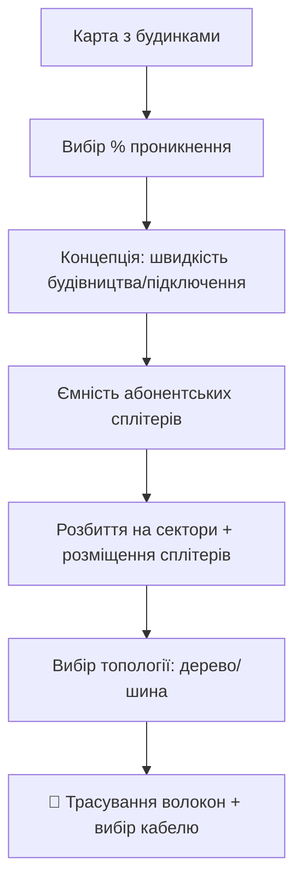
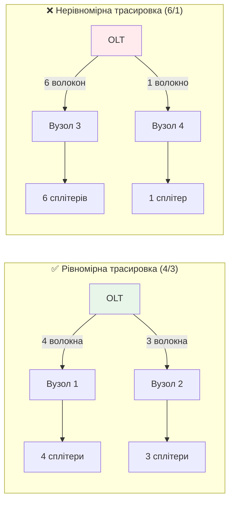
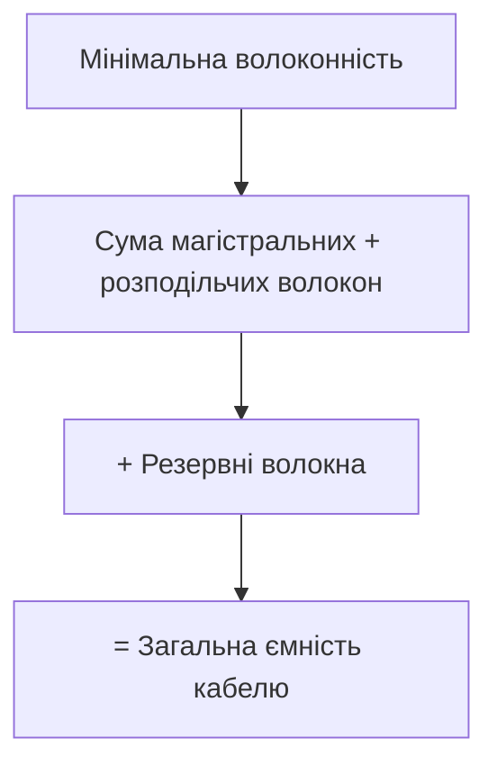
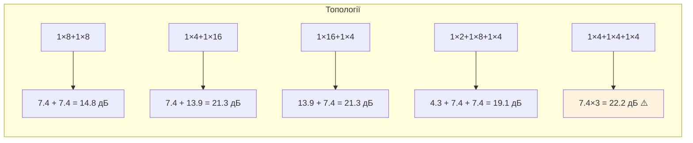
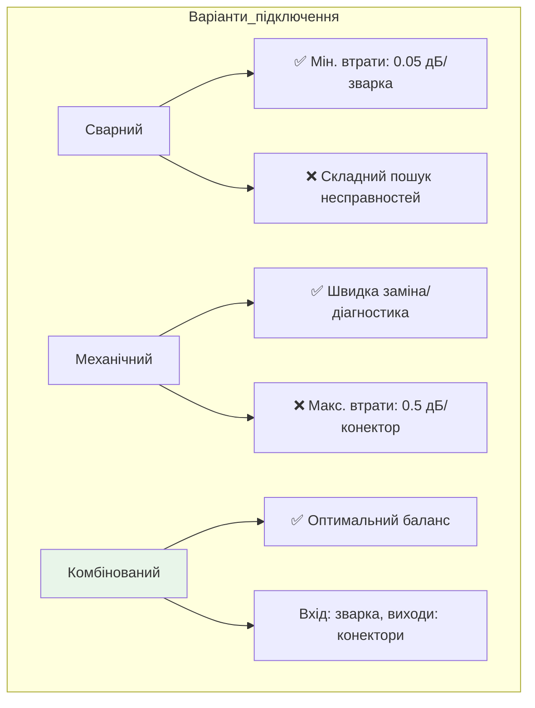
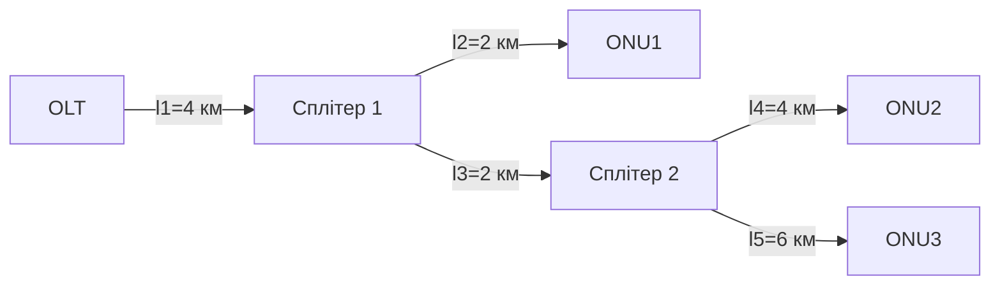

# 📚 Лекція 16: Трасування волокон, кабель, бюджет потужності та затухання

> **Тема:** Проектування оптичних трас, розрахунок бюджету, балансування мережі  
> **Мова:** Українська  
> **Дата створення:** `2026-05-18`  
> **Попередня частина:** [Лекція 15](./Lecture15_PON_Design.md)

---

## 📋 Зміст

1. [Трасування волокон та вибір ємності кабелю](#161-трасування-волокон-та-вибір-ємності-кабелю)
2. [Розрахунок оптичного бюджету](#162-розрахунок-оптичного-бюджету-потужності-та-бюджету-втрат)
3. [Балансування PON-мережі](#балансування-пон-мережі)
4. [Практичний приклад розрахунку](#практичний-приклад-розрахунку)
5. [Інструменти та чек-листи](#інструменти-та-чек-листи)

---

## 16.1 Трасування волокон та вибір ємності кабелю

### 🔹 Відправна точка проектування



> ✅ **Результат попередніх етапів**: схема з розміченими секторами та сплітерами (Рис. 16.1)

### 🔹 Рекомендації з трасування волокон

#### Рекомендація 1: Розділення ділянок

```yaml
Мета: Мінімізувати кількість зварювань → зменшити втрати

✅ Ідеал: Магістральні, розподільчі та абонентські волокна в різних кабелях
⚠️ Реальність: Компромісний варіант
  • Магістраль + розподільчі волокна → один кабель
  • Абонентські волокна → окремий кабель
  
Причина: Повне розділення часто неможливе через обмеження інфраструктури
```

#### Рекомендація 2: Мінімізація "навантаження" на кабель



| Критерій | Рівномірна (4/3) | Нерівномірна (6/1) |
|----------|-----------------|-------------------|
| **Волоконність кабелю** | "Четвірка" на більшості ділянок | "Вісімка" на 3 ділянках |
| **Наслідки обриву** 🔴 | Відключено 4 сплітери | Відключено 6 сплітерів |
| **Вартість** | Нижча | Вища |
| **Надійність** | ✅ Вища | ❌ Нижча |

> 💡 **Правило**: Чим рівномірніше розподілені волокна від OLT, тим оптимальніша трасировка.

### 🔹 Визначення волоконності кабелю



#### 📊 Норми резервування волокон

| Ділянка мережі | Рекомендований резерв | Обґрунтування |
|----------------|----------------------|---------------|
| **Магістральна** | 50-100% | Критична ділянка, складна заміна |
| **Розподільча** | 20-50% | Можливість масштабування секторів |
| **Абонентська** | 0-20% | Індивідуальні підключення, drop-кабелі |

```yaml
Приклад розрахунку для магістральної ділянки:
  • Основні волокна: 8 шт.
  • Резерв (75%): 6 шт.
  • Загальна ємність: 14 → округлюємо до стандарту: 16 волокон

Стандартні ємності кабелів:
  2, 4, 8, 12, 16, 24, 32, 48, 64, 72, 96, 144 волокна
```

> ⚠️ **Важливо**: При 100% проникненні достатньо 1-2 резервних волокна (експлуатаційний резерв). При низькому старті — закладати резерв під масштабування.

---

## 16.2 Розрахунок оптичного бюджету потужності та бюджету втрат

### 🔹 Основні поняття

```mermaid
graph LR
    A[Оптичний бюджет] --> B[Бюджет потужності]
    A --> C[Бюджет втрат]
    
    B --> B1[P_budget = P_Tx - P_Rx]
    B1 --> B2[Приклад: +4 дБм - (-26 дБм) = 30 дБ]
    
    C --> C1[Сума всіх втрат: OLT → ONU]
    C1 --> C2[Має бути < P_budget - запас]
```

#### 📐 Бюджет потужності (Power Budget)

```yaml
Формула:
  P_budget = P_Tx_min - P_Rx_min [дБ]

Типові значення для PON:
  • Потужність SFP OLT: ~ +4 дБм (діапазон: +2...+7 дБм)
  • Чутливість ONU: ~ -26 дБм (діапазон: -24...-28 дБм)
  
Розрахунок:
  P_budget = +4 дБм - (-26 дБм) = 30 дБ ✅

⚠️ Обережно: 
  • Якщо втрати < (P_Tx_max - P_Rx_max) → перевантаження приймача!
  • Якщо втрати > (P_Tx_min - P_Rx_min) → недостатній сигнал
```

#### 📉 Бюджет втрат (Loss Budget) — складові

| Компонент | Затухання, дБ | Примітки |
|-----------|--------------|----------|
| **Конектор (SC/LC)** | 0.2-0.5 | Макс. 0.5 дБ для розрахунків |
| **Зварювання** | 0.01-0.1 | Макс. 0.05 дБ для розрахунків |
| **Волокно @1310 нм** | 0.35 дБ/км | Для uplink (ONU→OLT) |
| **Волокно @1490/1550 нм** | 0.22-0.24 дБ/км | Для downlink (OLT→ONU) |
| **Сплітер** | Див. таблицю нижче | Залежить від коефіцієнта ділення |

### 🔹 Енергетичні класи GPON (ITU-T G.984.2)

```yaml
Класи оптичних систем:

| Клас | Мін. втрати, дБ | Макс. втрати, дБ | Застосування |
|------|----------------|-----------------|--------------|
| А    | 5              | 20              | Короткі лінії, малі спліти |
| В    | 10             | 25              | Стандартне розгортання |
| В+   | 10             | 28              | ✅ Найпоширеніший |
| С    | 15             | 30              | Довгі лінії, великі спліти |
| С+   | 15             | 32              | PX30 модулі, запас потужності |
| С++  | 15             | 35              | PX40 модулі, максимальна дальність |

💡 Ширина діапазону будь-якого класу = 15 дБ
   → Визначається динамічним діапазоном детекторів ONU
```

#### 📊 Характеристики OLT/ONU за класами

```yaml
Клас C+ (потужний):
  OLT:
    • Tx: +3...+7 дБм
    • Rx: -32 дБм (чутливість)
  ONU:
    • Tx: +0.5...+5 дБм
    • Rx: -30 дБм

Клас B+ (стандартний):
  OLT:
    • Tx: +1.5...+5 дБм
    • Rx: -28 дБм
  ONU:
    • Tx: +0.5...+5 дБм
    • Rx: -27 дБм
```

### 🔹 Затухання в сплітерах (довідкова таблиця)

#### Планарні (PLC) сплітери — рівномірне ділення

| Сплітер | Затухання, дБ | Примітка |
|---------|--------------|----------|
| **1×2** | 4.3 | Теоретично: 3.0 дБ + втрати |
| **1×4** | 7.4 | ✅ Найкраща рівномірність |
| **1×8** | 10.7 | Популярний для 2-рівневих схем |
| **1×16** | 13.9 | Баланс втрат/ємності |
| **1×32** | 17.2 | Для великих секторів |
| **1×64** | 21.5 | Макс. для одно рівневих |

#### Зварні (FBT) сплітери — нерівномірне ділення (для шин)

| Ділення | Затухання X, дБ | Затухання Y, дБ | Δ, дБ | Застосування |
|---------|----------------|----------------|-------|--------------|
| **5/95** | 13.70 | 0.32 | 13.38 | Початок шини |
| **10/90** | 10.08 | 0.49 | 9.59 | — |
| **20/80** | 7.11 | 1.06 | 6.05 | — |
| **30/70** | 5.39 | 1.56 | 3.83 | — |
| **40/60** | 4.01 | 2.34 | 1.67 | — |
| **45/55** | 3.73 | 2.71 | 1.02 | Балансування |
| **50/50** | 3.17 | 3.19 | 0.02 | Рівномірне ділення |

> 💡 **Правило**: Затухання каскаду сплітерів > затухання одного еквівалентного:
> - 1×16: ~13.9 дБ
> - 1×4 + 1×4: 7.4 + 7.4 = 14.8 дБ ❌

---

## Балансування PON-мережі

### 🔹 Чому важлива балансировка?

```mermaid
graph TD
    A[Несбалансована мережа] --> B[Різні рівні сигналу від ONU]
    B --> C[Перевантаження детектора OLT]
    C --> D[Збільшення помилок (BER)]
    D --> E[Нестабільне з'єднання]
    
    F[Збалансована мережа] --> G[Однаковий рівень сигналу]
    G --> H[Оптимальна робота детектора]
    H --> I[Мінімальні помилки]
    I --> J[Стабільна робота]
```

> ⚠️ **Критичний поріг**: Різниця рівнів сигналів > 15 дБ → система не може коректно детектувати!

### 🔹 Швидка оцінка бюджету втрат (без детальної топології)

#### Для древовидних топологій



> 📊 **Максимальне затухання каскаду**: ~22.4 дБ (для 3-рівневого дерева)  
> 🎯 **Запас бюджету**: 30 - 22.4 = **7.6 дБ** (на волокно + з'єднання)

#### Для шинних топологій

```yaml
Приклад: "16FBT+1×4" (найгірший випадок)

Розрахунок для останнього абонента:
  • Каскад FBT: 4×0.32 дБ = 1.28 дБ
  • Останній FBT (5/95): 13.7 дБ
  • PLC 1×4: 7.4 дБ
  • Разом: 1.28 + 13.7 + 7.4 = 22.38 дБ

✅ Висновок: Макс. затухання шини ≈ 22.4 дБ (як у дерева)
```

### 🔹 Врахування з'єднань: схеми "включення" сплітерів



#### Розрахунок втрат на з'єднаннях

```yaml
Дерево "1×2+1×8+1×4" (комбіноване підключення):
  • Проходження через 3 PLC-сплітери
  • На кожному: 1 зварка (0.05) + 1 конектор (0.5) = 0.55 дБ
  • Разом: 3 × 0.55 = 1.65 дБ

Шина "16FBT+1×4":
  • 14 FBT-сплітерів: 14 × 2 зварки × 0.05 = 1.4 дБ
  • 1 PLC-сплітер: 0.05 + 0.5 + 0.05 = 0.6 дБ
  • Разом: 1.4 + 0.6 = 2.0 дБ

📊 Загальний бюджет втрат:
  • Дерево: 22.4 + 1.65 = 24.05 дБ → запас: 5.95 дБ
  • Шина: 22.38 + 2.0 = 24.38 дБ → запас: 5.62 дБ
  
⚠️ Експлуатаційний резерв: -3 дБ
✅ Реальний запас на прокладку: ~3 дБ
```

---

## Практичний приклад розрахунку

### 🔹 Вхідні дані



```yaml
Параметри:
  • Затухання конектора (АР): 0.3 дБ
  • Затухання зварки (АС): 0.05 дБ
  • α @1310 нм: 0.35 дБ/км (беремо гірший випадок)
  • Довжини: l1=4км, l2=2км, l3=2км, l4=4км, l5=6км
  • Клас системи: С (динамічний діапазон: 29 дБ)
  • Експлуатаційний запас: 3 дБ
```

### 🔹 Крок 1: Розрахунок втрат без сплітерів

```python
# Формула: A = α×L + АР×N_кон + АС×N_звар + А_сплітерів

# Ланцюг OLT→ONU1:
A1 = (4+2)×0.35 + 4×0.3 + 2×0.05 + А_спл1 
   = 2.1 + 1.2 + 0.1 + А_спл1 
   = 3.4 + А_спл1 [дБ]

# Ланцюг OLT→ONU2:
A2 = (4+2+4)×0.35 + 4×0.3 + 4×0.05 + А_спл1 + А_спл2
   = 3.5 + 1.2 + 0.2 + А_спл1 + А_спл2
   = 4.9 + А_спл1 + А_спл2 [дБ]

# Ланцюг OLT→ONU3:
A3 = (4+2+6)×0.35 + 4×0.3 + 4×0.05 + А_спл1 + А_спл2
   = 4.2 + 1.2 + 0.2 + А_спл1 + А_спл2
   = 5.6 + А_спл1 + А_спл2 [дБ]
```

### 🔹 Крок 2: Підбір коефіцієнтів ділення сплітерів

#### Балансування сплітера S2 (ONU2 vs ONU3)

```yaml
Різниця втрат без сплітера: 5.6 - 4.9 = 0.7 дБ

З таблиці FBT обираємо найближче Δ:
  • 45/55: Δ = 1.02 дБ (Ах=3.73, Ау=2.71) ✅

Призначення:
  • 45% потужності → ONU2: втрати 3.73 дБ
  • 55% потужності → ONU3: втрати 2.71 дБ

Оновлені формули:
  A2 = 4.9 + А_спл1 + 3.73 = 8.63 + А_спл1
  A3 = 5.6 + А_спл1 + 2.71 = 8.31 + А_спл1
```

#### Балансування сплітера S1 (ONU1 vs група ONU2/3)

```yaml
Макс. різниця: (8.63 + А_спл1) - (3.4 + А_спл1) = 5.23 дБ

З таблиці обираємо:
  • 25/75: Δ = 4.87 дБ (Ах=6.29, Ау=1.42) ✅

Призначення:
  • 25% → ONU1: втрати 6.29 дБ
  • 75% → група: втрати 1.42 дБ

Фінальні втрати:
  A1 = 3.4 + 6.29 = 9.69 дБ
  A2 = 8.63 + 1.42 = 10.05 дБ  
  A3 = 8.31 + 1.42 = 9.73 дБ

Перевірка балансу:
  DIF = A2 - A1 = 10.05 - 9.69 = 0.36 дБ < 8 дБ ✅
```

### 🔹 Крок 3: Перевірка бюджету

```yaml
Найгірший випадок: ONU2 з втратами 10.05 дБ

Загальний бюджет з запасом:
  P_total = 10.05 + 3.0 (запас) = 13.05 дБ

Порівняння з динамічним діапазоном класу С:
  13.05 дБ < 29 дБ ✅ → Мережа працюватиме стабільно

Запас потужності:
  29 - 13.05 = 15.95 дБ → можливість подальшого розширення
```

### 🔹 Порівняння: збалансовані vs рівномірні сплітери

```yaml
Якщо використати тільки 50/50 сплітери (А=3.18 дБ кожен):

  A1 = 3.4 + 3.18 = 6.58 дБ
  A2 = 4.9 + 3.18 + 3.18 = 11.26 дБ
  A3 = 5.6 + 3.18 + 3.18 = 11.96 дБ

  Бюджет: 11.96 + 3 = 14.96 дБ < 29 дБ ✅ (ще в межах)
  
  АЛЕ: DIF = 11.96 - 6.58 = 5.38 дБ ⚠️
  
Висновок:
  • Для коротких ліній: рівномірні сплітери прийнятні
  • Для довгих/складних мереж: обов'язкове балансування!
```

---

## Інструменти та чек-листи

### 🔹 Формула повного розрахунку втрат

```math
A_Σ = α × L_Σ + A_W × N_W + A_C × N_C + A_S [дБ]
```

| Символ | Опис | Типове значення |
|--------|------|----------------|
| **A_Σ** | Сумарні втрати | — |
| **α** | Затухання волокна | 0.35 дБ/км @1310нм |
| **L_Σ** | Сумарна довжина волокна | км |
| **A_W** | Втрати на зварці | 0.05 дБ |
| **N_W** | Кількість зварок | шт. |
| **A_C** | Втрати на конекторі | 0.3-0.5 дБ |
| **N_C** | Кількість конекторів | шт. |
| **A_S** | Втрати на каскаді сплітерів | див. таблицю |

### 🔹 Чек-лист розрахунку бюджету

```markdown
## ✅ Підготовка
- [ ] Визначено клас системи (A/B/C/C+)
- [ ] Відомі P_Tx та P_Rx для OLT/ONU
- [ ] Обрано довжину хвилі для розрахунку (1310/1490/1550 нм)

## ✅ Збір параметрів мережі
- [ ] Виміряно довжини всіх ділянок (L_Σ)
- [ ] Підраховано кількість зварок (N_W) та конекторів (N_C)
- [ ] Визначено топологію та коефіцієнти сплітерів

## ✅ Розрахунок
- [ ] Розраховано A_Σ для кожного ланцюга OLT→ONU
- [ ] Перевірено баланс: max(A_i) - min(A_i) < 8-15 дБ
- [ ] Додано експлуатаційний запас (3-4 дБ)
- [ ] Порівняно з динамічним діапазоном: A_Σ + запас < P_budget

## ✅ Документування
- [ ] Створено таблицю втрат для всіх ONU
- [ ] Вказано резерв потужності для майбутнього розширення
- [ ] Додано рекомендації з моніторингу (OTDR, потужність)
```

### 🔹 Excel-шаблон для розрахунків (структура)

```csv
ONU_ID,Distance_km,Splices,Connectors,Splitter_Cascade,Splitter_Loss_dB,Fiber_Loss_dB,Total_Loss_dB,Margin_dB,Status
ONU1,6.0,2,4,"1x2+1x8",11.7,2.1,14.35,14.65,OK
ONU2,10.0,4,4,"1x2+1x8+1x4",15.43,3.5,19.43,9.57,OK
ONU3,12.0,4,4,"1x2+1x8+1x4",15.43,4.2,20.13,8.87,OK
...
```

> 💡 **Порада**: Автоматизуйте розрахунки через Python/Excel — це зменшить помилки при великих мережах.

---

## 📎 Додатки

### 🔗 Корисні стандарти

```yaml
ITU-T:
  G.984.2: Фізичний рівень GPON (енергетичні класи)
  G.984.3: Протокол GTC та управління
  G.652: Характеристики одномодового волокна
  G.671: Пасивні оптичні компоненти

IEEE:
  802.3ah: EPON (розрахунок бюджету для 1000BASE-PX)

FSAN:
  • Deployment Guidelines: практичні рекомендації з проектування
  • Interoperability Specifications: сумісність обладнання
```

### 🔑 Ключові терміни

| Термін | Опис |
|--------|------|
| **Бюджет потужності** | Різниця між потужністю передавача та чутливістю приймача |
| **Бюджет втрат** | Сума всіх затухань на шляху сигналу від OLT до ONU |
| **Динамічний діапазон** | Діапазон рівнів сигналу, який може коректно обробити приймач (зазвичай 15 дБ) |
| **Балансування мережі** | Підбір параметрів сплітерів для вирівнювання рівнів сигналу на всіх ONU |
| **Експлуатаційний запас** | Резерв потужності (3-4 дБ) на деградацію компонентів та майбутнє розширення |
| **Точка росту** | Вільний порт сплітера або резервне волокно для підключення нових абонентів |

### 🛠️ Практичні поради

```bash
# 1. Завжди використовуйте гірші значення для розрахунків:
   • α = 0.35 дБ/км (не 0.22)
   • Конектор = 0.5 дБ (не 0.2)
   • Зварка = 0.05 дБ (не 0.01)

# 2. Перевіряйте обидва напрямки:
   • Uplink (1310 нм): вищі втрати у волокні, але менші в сплітерах
   • Downlink (1490/1550 нм): нижчі втрати у волокні

# 3. Не забувайте про температурний вплив:
   • Затухання волокна зростає при низьких температурах
   • Додайте +0.5-1 дБ запасу для мереж у холодному кліматі

# 4. Документуйте все:
   • Фото місць зварювання
   • Схеми кросування
   • Результати вимірювань OTDR після монтажу
```

---

> 💾 **Збережено для GitHub**  
> Файл: `Lecture16_PON_Tracing_Budget.md`  
> Формат: Markdown + Mermaid + Math  
> Сумісність: GitHub, GitLab, VS Code, Obsidian, Typora

```bash
# Команди для завантаження в репозиторій:
git add Lecture16_PON_Tracing_Budget.md
git commit -m "docs: add Lecture 16 - Fiber Tracing & Power Budget Calculation"
git push origin main

# Оновлення навігації:
echo "- [Лекція 16: Трасування та бюджет](./Lecture16_PON_Tracing_Budget.md)" >> README.md
```

✅ **Серія лекцій з проектування PON завершена!**

---

> 🎓 **Підсумок курсу "Оптичні технології на мережі доступу"**:
> 
> | Лекція | Тема | Навички після вивчення |
> |--------|------|------------------------|
> | 13 | Введення в FTTx/PON | Розуміння архітектури, компонентів, класів втрат |
> | 14 | Порівняння технологій | Вибір між GPON/EPON/WDM-PON, розуміння еволюції |
> | 15 | Проектування: топології | Вибір топології, % проникнення, стратегії масштабування |
> | 16 | Трасування та бюджет | Розрахунок втрат, балансування, практичне проектування |
> 
> 🔧 **Фінальний результат**: Здатність самостійно спроектувати, розрахувати та задокументувати PON-мережу будь-якої складності з урахуванням технічних, економічних та експлуатаційних вимог.

