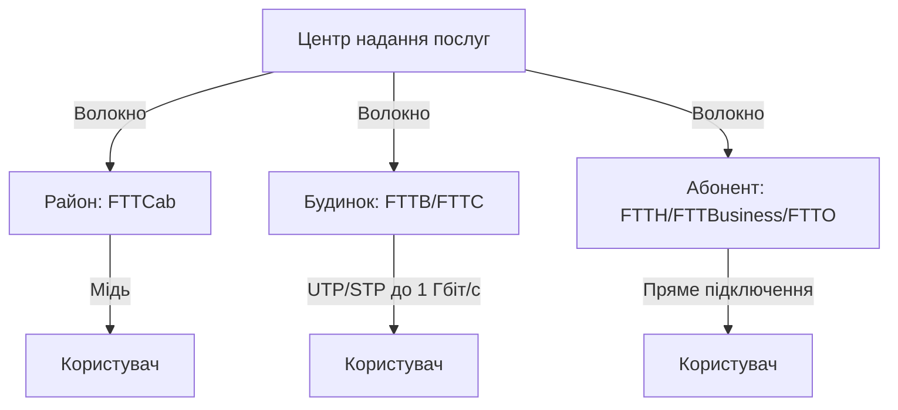
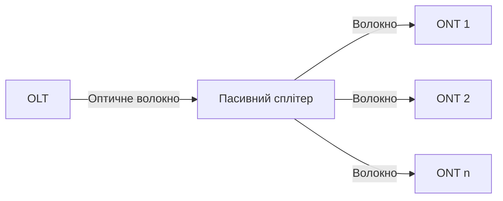
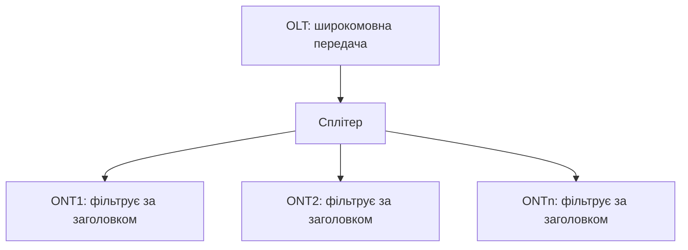

# 📚 Лекція 13: Оптичні технології на мережі доступу (частина 1)

> **Тема:** Волокно на мережі доступу, FTTx, PON, GPON, EPON  
> **Мова:** Українська  
> **Дата створення:** `2026-05-18`

---

## 📋 Зміст

1. [Волокно на мережі доступу](#131-волокно-на-мережі-доступу)
2. [Сучасні концепції FTTx](#132-сучасні-концепції-впровадження-оптики-на-мережі-доступу)
3. [Пасивні оптичні мережі (PON)](#133-пасивні-оптичні-мережі-доступу)
4. [Технології PON](#134-технології-пасивних-оптичних-мереж)
5. [Технологія GPON](#135-технологія-gpon)
6. [Технологія EPON](#136-технологія-eponepon)
7. [Інтерфейси Ethernet для мереж доступу](#137-основні-типи-інтерфейсів-ethernet)

---

## 13.1 Волокно на мережі доступу

### 🔹 Мережа доступу — визначення
> **Мережа доступу** — сукупність апаратних засобів і кабельних ліній від абонента до найближчого комутатора.

### 🔹 Еволюція технологій

| Етап | Технологія | Опис |
|------|-----------|------|
| **Традиційна** | Мідні кабелі | Симетричні та коаксіальні кабелі |
| **Гібридна** | **HFC** (Hybrid Fiber/Coaxial) | Волокно + коаксіал; волокно до розподільчих вузлів (~2000 користувачів), далі — коаксіал |
| **Сучасна** | **FTTx** (Fiber To The X) | Оптичне волокно наближається до абонента |

### 🔹 Гібридна мережа HFC


**Послуги HFC:**
- 📺 **Широкомовні**: телевізійне мовлення
- 🎯 **Адресні**: Інтернет, IP-телефонія, VoD (Video on Demand)

> ⚠️ **Виклик**: Адресні послуги створюють значний **зворотний трафік** (від користувача до вузла), що вимагає переходу на цифрове ТБ та підвищення спектральної ефективності.

### 🔹 Спектральна ефективність

```
γ = B / Δf
```
де:
- `γ` — спектральна ефективність [біт/с/Гц]
- `B` — швидкість передавання [біт/с]
- `Δf` — ширина робочої смуги [Гц]

---

## 13.2 Сучасні концепції впровадження оптики на мережі доступу

### 🔹 FTTx — загальна концепція

> **FTTx** (Fiber To The X) — волокно до точки **X**, де оптичний сигнал перетворюється в електричний через **ONU** (Optical Network Unit) або медіа-конвертер.

### 🔹 Класифікація FTTx (за наближенням до абонента)

| Акронім | Розшифровка | Опис | Стандарт ITU |
|---------|-------------|------|--------------|
| **FTTA** | Fiber To The Apartment | Волокно до квартири | — |
| **FTTB** | Fiber To The Building | Волокно до будинку | ✅ G.983.5 |
| **FTTBusiness** | Fiber To The Business | Волокно для бізнесу (аналог FTTH, але для кількох користувачів) | ✅ |
| **FTTC / FTTCab** | Fiber To The Curb/Cabinet | Волокно до розподільчої шафи | ✅ G.983.2, G.983.5 |
| **FTTD** | Fiber To The Desk | Волокно до робочого столу | — |
| **FTTE** | Fiber To The Exchange | Волокно до АТС оператора | — |
| **FTTF** | Fiber To The Feeder | Волокно до пасивної коаксіальної проводки | — |
| **FTTH** | Fiber To The Home | Волокно безпосередньо до помешкання | ✅ G.983.5 |
| **FTTK** | Fiber To The Kerb | Волокно до бордюру/шафи | — |
| **FTTN** | Fiber To The Node/Neighborhood | Волокно до вузла/мікрорайону | — |
| **FTTO** | Fiber To The Office | Волокно до офісу (розвиток FTTB) | ✅ G.982 |
| **FTTOpt** | Fiber To The Optimum | Волокно до оптимальної точки | — |
| **FTTP** | Fiber To The Premises | Волокно до приміщення (універсальний термін) | — |
| **FTTR** | Fiber To The Remote | Волокно до віддаленого користувача | — |
| **FTTS** | Fiber To The School | Волокно до школи | — |
| **FTTSub** | Fiber To The Subscriber | Волокно до абонента | — |
| **FTTU** | Fiber-To-The-User | Волокно до користувача | — |
| **FTTW** | Fiber To The Workplace | Волокно до робочого місця | — |
| **FTTZ** | Fiber To The Zone | Волокно до зони доступу | — |

> 💡 **Примітка**: Багато концепцій дублюють одна одну або є маркетинговими термінами.

### 🔹 Три зони наближення волокна (за ITU)



### 🔹 Ключові компоненти архітектури

| Акронім | Розшифровка | Функція |
|---------|-------------|---------|
| **OLT** | Optical Line Termination | Оптичне лінійне закінчення (на стороні оператора) |
| **ONU** | Optical Network Unit | Оптичний мережний блок (розподільчий) |
| **ONT** | Optical Network Termination | Оптичне мережне закінчення (на стороні абонента) |
| **NT** | Network Termination | Мережне закінчення (абонентське) |

### 🔹 Порівняння концепцій

| Концепція | Переваги | Недоліки | Застосування |
|-----------|----------|----------|--------------|
| **FTTCab** | ✅ Низька вартість, простота | ❌ Обмежена швидкість на мідній ділянці | Масове розгортання в районах |
| **FTTB/FTTC** | ✅ Швидкість до 1 Гбіт/с, підтримка інтерактивних послуг | ❌ Потребує активного обладнання в будинку | Багатоквартирні будинки |
| **FTTH/FTTO** | ✅ Максимальна пропускна здатність, майбутнє-доказність | ❌ Висока вартість інсталяції | Приватний сектор, бізнес, офіси |

> 📌 **FTTH ≠ GPON**:  
> - **FTTH** — фізична архітектура (волокно до дому)  
> - **GPON** — технологія передачі даних по цьому волокні

---

## 13.3 Пасивні оптичні мережі доступу (PON)

### 🔹 Що таке PON?

> **PON** (Passive Optical Network) — мережа доступу, побудована на **пасивних** оптичних компонентах (без активного живлення на ділянці розподілу).



### 🔹 Пасивні компоненти PON

- ✅ Одномодові оптичні волокна та кабелі (ITU G.652)
- ✅ Стрічкові оптичні кабелі
- ✅ Оптичні роз'єми
- ✅ Пасивні розгалужувачі (сплітери)
- ✅ Оптичні атенюатори
- ✅ Зрощення волокон

> ⚡ **Активні компоненти** (підсилювачі, передавачі, ONU) — лише на кінцях мережі (OLT та ONT).

### 🔹 Енергетичний баланс PON

**Ключовий параметр**: вихідна оптична потужність має бути достатньою для всіх абонентів, але не викликати нелінійні ефекти у волокні.

#### 📊 Класи оптичних систем (ITU G.982)

| Параметр | Клас A | Клас B | Клас C |
|----------|--------|--------|--------|
| **Мінімальні втрати**, дБ | 5 | 10 | 15 |
| **Максимальні втрати**, дБ | 20 | 25 | 30 |

> ⚠️ Клас C має суворіші вимоги для систем з TDM через додаткові втрати в сплітерах 1:2.

### 🔹 Організація двостороннього зв'язку в PON

#### Варіант 1: Два волокна
- 📥 Одне волокно: мережа → користувач
- 📤 Друге волокно: користувач → мережа  
> ❌ Збільшує вартість, не використовує повний потенціал волокна

#### Варіант 2: Одне волокно + WDM


| Метод | Низхідний потік (↓) | Висхідний потік (↑) |
|-------|---------------------|---------------------|
| **WDM + TDM** | WDM (1490/1550 нм) | TDM (1310 нм) |
| **Повний WDM** | WDM (1490/1550 нм) | WDM (інша λ) |

### 🔹 Топології PON

- 🔹 **Точка-точка** (Point-to-Point)
- 🔹 **Точка-мультиточка** (Point-to-Multipoint) ← найпоширеніша
- 🔹 **Кільцева** (Ring)

#### Розміщення пасивного сплітера:
1. 🏢 В приміщенні OLT (центр послуг)
2. 🏠 В приміщенні ONT (абонент)
3. 🌳 Вуличне (вимагає захисту від клімату та вандалів)

---

## 13.4 Технології пасивних оптичних мереж

### 🔹 Принцип передачі в PON



> 📺 **Аналогія з кабельним ТБ**: OLT передає потік усім, кожен ONT "відфільтровує" лише свої дані.

### 🔹 Робочі довжини хвиль у PON

| Довжина хвилі | Напрямок | Призначення |
|---------------|----------|-------------|
| **1310 нм** | ↑ Висхідний | Голос + дані (абонент → оператор) |
| **1490 нм** | ↓ Низхідний | Голос + дані (оператор → абонент) |
| **1550 нм** | ↓ Низхідний | Відео (TV, VoD) |

> 🎬 Якщо відео-контент не передається → використовуються лише **1310 нм** та **1550 нм** (або 1490 нм).

### 🔹 Зворотний канал: TDM (Time Division Multiplexing)

```
🕐 Цикл опитування = 125 мкс
├─ Timeslot 1 → ONT₁ (активний)
├─ Timeslot 2 → ONT₂ (активний)
├─ ...
└─ Timeslot N → ONTₙ (активний)
```

> ✅ Користувач не відчуває перерв — створюється ілюзія безперервного з'єднання.

### 🔹 Порівняння технологій PON

| Технологія | Стандарт | Транспортний протокол | Швидкість (↓/↑) | Рік |
|------------|----------|----------------------|-----------------|-----|
| **APON** | ITU G.983.1 (v1) | ATM | 155 Мбіт/с / 155 Мбіт/с | 1998 |
| **BPON** | ITU G.983.1 (v2005) | ATM | 155/622/1244 Мбіт/с / 155/622 Мбіт/с | 2005 |
| **GPON** | ITU G.984.x | SDH + GFP | до 2.5 Гбіт/с / 1.25 Гбіт/с | 2003-2004 |
| **EPON** | IEEE 802.3ah | Ethernet | 1 Гбіт/с / 1 Гбіт/с | 2004 |

> ✅ **Рекомендовані до впровадження**: **GPON** та **EPON**

---

## 13.5 Технологія GPON

### 🔹 Основи GPON

- 📜 **Стандарт**: ITU-T G.984.x (2003–2004)
- 🔄 **Транспорт**: SDH + **GFP** (Generic Framing Protocol)
- 🎯 **Цілі розробки**:
  - Гігабітні швидкості
  - Висока пропускна спроможність фізичного рівня
  - Ефективний спектральний протокол

### 🔹 Швидкості GPON

| Низхідний (↓) | Висхідний (↑) |
|---------------|---------------|
| 1244.16 Мбіт/с | 155.52 Мбіт/с |
| 1244.16 Мбіт/с | 622.08 Мбіт/с |
| 1244.16 Мбіт/с | 1244.16 Мбіт/с |
| **2488.32 Мбіт/с** | 155.52 Мбіт/с |
| **2488.32 Мбіт/с** | 622.08 Мбіт/с |
| **2488.32 Мбіт/с** | 1244.16 Мбіт/с |
| **2488.32 Мбіт/с** | **2488.32 Мбіт/с** |

### 🔹 Довжини хвиль GPON

| Потік | 1 волокно | 2 волокна |
|-------|-----------|-----------|
| **↓ Низхідний** | 1480–1500 нм | 1260–1360 нм |
| **↑ Висхідний** | 1260–1360 нм | 1260–1360 нм |

### 🔹 Інкапсуляція в GPON (2 рівні)


1. **GEM** (GPON Encapsulation Method):
   - Змінна довжина пакетів
   - Фрагментація для ефективності смуги
   - Аналог **GFP** (ITU G.7401)

2. **GTC** (GPON Transmission Convergence):
   - Об'єднує ATM-комірки + GEM-пакети
   - Керування: **OAM**, **PLOAM**, **OMCI**
   - **DBA** (Dynamic Bandwidth Assignment) — динамічне розподілення смуги

### 🔹 Модифікація кадрів Ethernet у GPON

```diff
Стандартний Ethernet кадр:
[Преамбула][DA][SA][L/T][Дані][Pad][FCS]

GPON-модифікована преамбула:
+ [SOP: 1 байт] — початок пакету
+ [Reserved: 4 байти]
+ [LLID: 2 байти] — логічний ідентифікатор вузла
  • Біт 0: режим (unicast/multicast)
  • Біти 1-15: адреса вузла
+ [CRC: 1 байт] — контроль преамбули
[Решта кадру без змін]
```

#### Поля кадру GPON/Ethernet:

| Поле | Розмір | Опис |
|------|--------|------|
| **SOP** | 1 байт | Start of Packet |
| **Reserved** | 4 байти | Резерв |
| **LLID** | 2 байти | Logical Link ID (унікальний для вузла) |
| **CRC** | 1 байт | Контрольна сума преамбули |
| **DA** | 6 байт | MAC-адреса призначення (Unicast/Multicast/Broadcast) |
| **SA** | 6 байт | MAC-адреса відправника |
| **L/T** | 2 байти | Length / Type |
| **Data** | змінна | Корисне навантаження |
| **Pad** | змінна | Доповнення до мінімуму |
| **FCS** | 4 байти | Frame Check Sequence (CRC-32) |

### 🔹 Службові кадри GPON

- 📦 **Фіксована довжина**: 64 байти
- 🔑 **L/T = 0x8809** — маркер управляючого кадру
- 📋 **Типи команд**:
  - `GATE` (від OLT) — виділяє timeslot для передачі
  - `REPORT` (від ONT) — запитує смугу

```
Управляючий кадр:
[Преамбула+LLID][DA][SA][L/T=0x8809][Opcode][Timestamp][Message: 40 байт]
```

---

## 13.6 Технологія EPON (GEPON)

### 🔹 Основи EPON

- 📜 **Стандарт**: IEEE 802.3ah (1 Гбіт/с), ITU G.985 (100 Мбіт/с, точка-точка)
- 🔄 **Транспорт**: Ethernet (native)
- 🌊 **Довжини хвиль**:
  - ↓ 1490 нм або 1550 нм (1 Гбіт/с)
  - ↑ 1310 нм (1 Гбіт/с)
  - *Допускається обидва потоки на 1310 нм*

### 🔹 Уникнення колізій: протокол MPCP

> **MPCP** (Multi-Point Control Protocol) — керує доступом до спільного середовища.

| Команда | Від кого | Призначення |
|---------|----------|-------------|
| **GATE** | OLT → всі ONT | Виділяє час початку та тривалість передачі |
| **REPORT** | ONT → OLT | Повідомляє про потребу в смузі |

#### Синхронізація часу:
- OLT передає **таймстампи** в `GATE`
- ONT звіряє свій годинник
- При розходженні > поріг → ONT переходить у режим ініціалізації

> ⚠️ **Відмінність від GPON**: EPON **не підтримує фрагментацію кадрів** → якщо кадр не вміщується у timeslot, він чекає наступного циклу.

### 🔹 Таймінги EPON

| Подія | Тривалість |
|-------|------------|
| Кадр **GATE** (72 байти) | ~6 мкс |
| Макс. кадр **Ethernet** (1526 байт) | ~12 мкс |
| **RTT** (Round-Trip Time, 20 км) | ~200 мкс |

### 🔹 Формат кадру EPON

Аналогічний GPON:
```
[SOP:1][Res:4][LLID:2][CRC:1] + стандартний Ethernet кадр
```

---

## 13.7 Основні типи інтерфейсів Ethernet (IEEE 802.3ah)

### 🔹 Мідні інтерфейси

| Інтерфейс | Швидкість | Середовище | Дистанція | Кодування | BER / Запас |
|-----------|-----------|------------|-----------|-----------|-------------|
| **2BASE-TL** | 0.5–5.5 Мбіт/с | Симетрична пара (×1+) | до 2.7 км | 64/65 октети | 10⁻⁷ / 5 дБ |
| **10PASS-TS** | 2.5–100 Мбіт/с | Симетрична пара (×1+) | до 0.75 км | 64/65 октети | 10⁻⁷ / 6 дБ |

### 🔹 Оптичні інтерфейси (100 Мбіт/с)

| Інтерфейс | Волокна | λ ↓ / λ ↑ | Дистанція | Кодування | Макс. втрати |
|-----------|---------|-----------|-----------|-----------|--------------|
| **100BASE-LX10** | 2× SMF | 1310 / 1310 нм | 0.5 м – 10 км | 4B/5B | 6 дБ |
| **100BASE-BX10** | 1× SMF (WDM) | 1510 / 1310 нм | 0.5 м – 10 км | 4B/5B | 5.5 дБ ↓ / 6 дБ ↑ |

### 🔹 Оптичні інтерфейси (1 Гбіт/с)

| Інтерфейс | Волокна | λ ↓ / λ ↑ | Дистанція | Кодування | Макс. втрати |
|-----------|---------|-----------|-----------|-----------|--------------|
| **1000BASE-LX10** | 2× SMF або MMF | 1310 / 1310 нм | 10 км (SMF) / 550 м (MMF) | 8B/10B | 6 дБ (SMF) / 2.4 дБ (MMF) |
| **1000BASE-BX10** | 1× SMF (WDM) | 1490 / 1310 нм | 0.5 м – 10 км | 8B/10B | 5.5 дБ ↓ / 6 дБ ↑ |
| **1000BASE-PX10** | 1× SMF (PON) | 1490 / 1310 нм | до 10 км | 8B/10B | 20 дБ ↓ / 19.5 дБ ↑ (мін. 5 дБ) |
| **1000BASE-PX20** | 1× SMF (PON) | 1490 / 1310 нм | до 20 км | 8B/10B | 24 дБ ↓ / 23.5 дБ ↑ (мін. 10 дБ) |

> 🔤 **Суфікси інтерфейсів**:
> - `D` / `O` — низхідний потік (Downstream / Optical)
> - `U` / `R` — висхідний потік (Upstream / Receive)

---

## 📎 Додатки

### 🔗 Корисні стандарти ITU/IEEE

```yaml
ITU-T:
  G.652: Одномодові волокна
  G.671: Пасивні оптичні компоненти
  G.704.1: GFP (Generic Framing Protocol)
  G.982: Загальні вимоги до PON
  G.983.1–.5: APON/BPON специфікації
  G.984.1–.4: GPON специфікації
  G.985: EPON (100M, точка-точка)

IEEE:
  802.3ah: EPON (1G) та мідні інтерфейси доступу
```

### 🔑 Ключові терміни

| Термін | Визначення |
|--------|------------|
| **ONU/ONT** | Оптичний мережний блок/термінакл (абонентський) |
| **OLT** | Оптичний лінійний термінакл (операторський) |
| **WDM** | Wavelength Division Multiplexing — хвильове мультиплексування |
| **TDM** | Time Division Multiplexing — часове мультиплексування |
| **GFP** | Generic Framing Protocol — універсальне кадрове інкапсулювання |
| **DBA** | Dynamic Bandwidth Assignment — динамічне розподілення смуги |
| **LLID** | Logical Link Identifier — логічний ідентифікатор з'єднання |
| **MPCP** | Multi-Point Control Protocol — протокол керування доступом у EPON |

---
