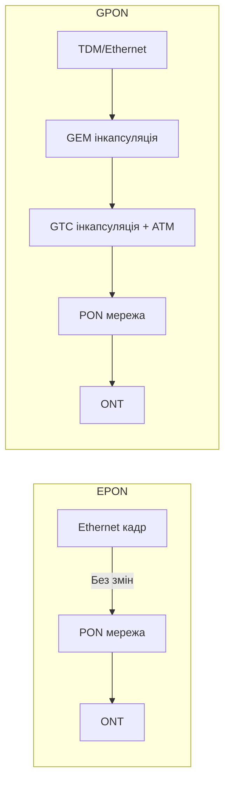
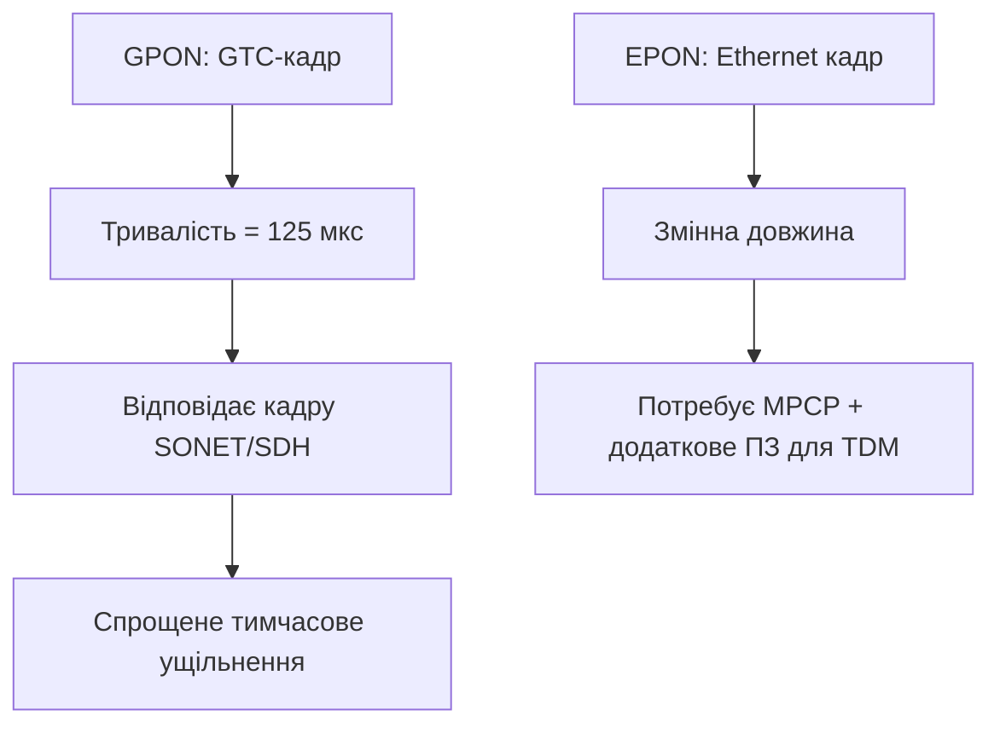
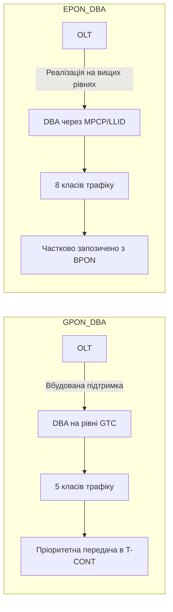
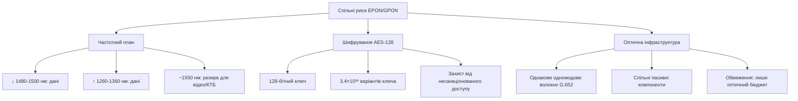
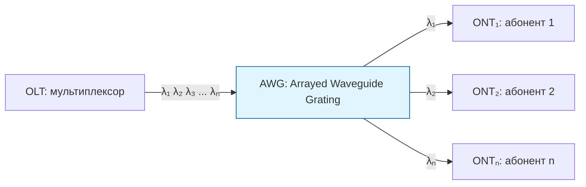
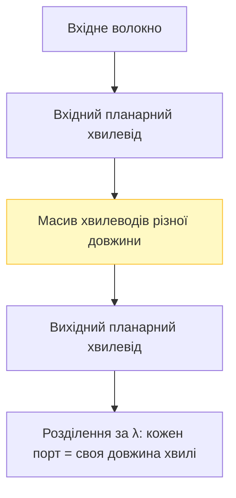
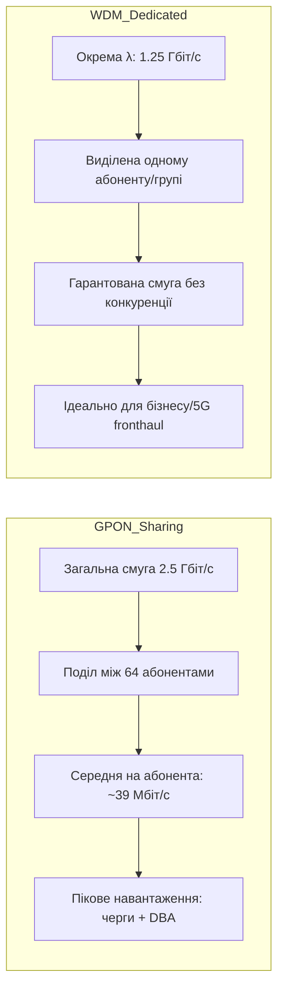
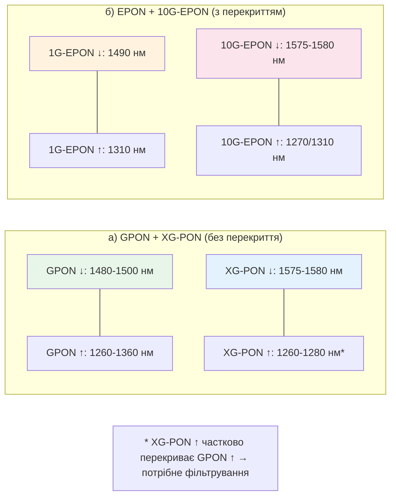
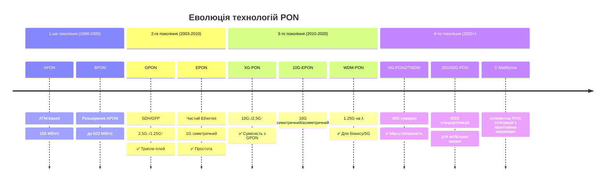

# 📚 Лекція 14: Оптичні технології на мережі доступу (частина 2)

> **Тема:** Порівняння GPON/EPON, WDM-PON, перспективи NG-PON  
> **Мова:** Українська  
> **Дата створення:** `2026-05-18`  
> **Попередня частина:** [Лекція 13](./Lecture13_Optical_Access_Part1.md)

---

## 📋 Зміст

1. [Відмінності технологій GPON та EPON](#141-відмінності-технологій-gpon-та-epon)
2. [Подібність EPON та GPON](#142-подібність-epon-та-gpon)
3. [Порівняння стандартів PON](#143-порівняння-стандартів-пасивних-оптичних-мереж)
4. [Технологія WDM-PON](#144-поняття-та-особливості-розвитку-wdm-pon)
5. [Перспективи пасивних оптичних мереж](#145-перспективи-пасивних-оптичних-мереж)

---

## 14.1 Відмінності технологій GPON та EPON

### 🔹 Фундаментальна відмінність: спосіб передачі пакетів



| Аспект | **EPON** | **GPON** |
|--------|----------|----------|
| **Інкапсуляція** | Одно рівнева: Ethernet кадри передаються "як є" | Дворівнева: `TDM/Ethernet → GEM → GTC (+ATM)` |
| **Фрагментація** | ❌ Відсутня | ✅ GEM-фрагментація для ефективності смуги |
| **Ефективність смуги** | ~70% | **>93-95%** |
| **Кодування** | 8B/10B (20% надлишковість) | NRZ (без надлишковості) |
| **Реальна швидкість** | 1 Гбіт/с × 0.8 = **800 Мбіт/с** | 2.5 Гбіт/с × 0.95 = **~2.375 Гбіт/с** |

### 🔹 Швидкісні характеристики

```yaml
EPON:
  Низхідний (↓): 1.25 Гбіт/с (реально ~1 Гбіт/с)
  Висхідний (↑): 1.25 Гбіт/с (реально ~1 Гбіт/с)
  Проміжні швидкості: ❌ Не підтримує

GPON:
  Низхідний (↓): 2.488 Гбіт/с (або 1.244 Гбіт/с)
  Висхідний (↑): 155 / 622 / 1244 / 2488 Мбіт/с
  Проміжні швидкості: ✅ Гнучка масштабованість
```

### 🔹 Кількість абонентів та радіус мережі

| Параметр | EPON | GPON |
|----------|------|------|
| **Топологія** | Дерево 1×64 | Ліс дерев 1×128 |
| **Макс. радіус** | до 30 км¹ | до 20 км |
| **Макс. абонентів/порт** | 32 (64²) | 64 (128²) |
| **TDM реалізація** | Потребує додаткового ПЗ/апаратних ресурсів | Нативна підтримка через SDH-кадри |

> ¹ За умови використання підсилювачів  
> ² Залежить від класу оптичного бюджету

### 🔹 Механізм TDM (Time Division Multiplexing)



### 🔹 Кодування сигналу

| Метод | Опис | Вплив на пропускну здатність |
|-------|------|------------------------------|
| **8B/10B** (EPON) | Кожні 8 біт кодуються 10 бітами | ⬇️ -20% корисної швидкості |
| **NRZ** (GPON) | Non-Return-to-Zero, лінійне кодування | ✅ ~100% ефективність |

> 📊 **Практична ефективність**:
> - EPON: ~70% (враховуючи службові накладні + кодування)
> - GPON: **>93%** (завдяки GEM-фрагментації та NRZ)

### 🔹 Розподіл смуги (DBA) та QoS

#### Dynamic Bandwidth Allocation (DBA)



#### Класи якості обслуговування (QoS)

| Технологія | Кількість класів | Механізм пріоритизації |
|------------|-----------------|------------------------|
| **GPON** | 5 класів | Транспортні контейнери (T-CONT) з пріоритетами |
| **EPON** | 8 класів | LLID + MPCP з пріоритетними чергами |

### 🔹 Управління та обслуговування (OAM)

| Функція | EPON | GPON |
|---------|------|------|
| **Ідентифікація ONU** | MAC-адреса + LLID | Серійний номер + ONT_ID |
| **Протоколи управління** | SNMP, MPCP, EFM OAM | OMCI, OAM, PLOAM |
| **Передача керуючих команд** | У загальному потоці з даними | У заголовках GTC-кадрів |
| **Активація абонента** | Через LLID-мітки | Автоматичне виявлення + ONT_ID |

> 📋 **OMCI** (ONU Management and Control Interface) — стандартизований протокол управління в GPON, сумісний з TR-069.

---

## 14.2 Подібність EPON та GPON

### 🔹 Спільні характеристики



### 🔹 Частотний план (спільний)

| Потік | Діапазон довжин хвиль | Призначення |
|-------|----------------------|-------------|
| **↓ Низхідний** | 1480–1500 нм | Передача даних/голосу від OLT |
| **↑ Висхідний** | 1260–1360 нм | Передача даних/голосу від ONT |
| **📺 Відео** | ~1550 нм | Аналогове/цифрове ТБ (RF overlay) |

### 🔹 Шифрування

```yaml
AES-128 (Advanced Encryption Standard):
  Довжина ключа: 128 біт
  Кількість комбінацій: 2¹²⁸ ≈ 3.4 × 10³⁸
  Об'єкт шифрування:
    • EPON: корисне навантаження Ethernet-кадру
    • GPON: корисне навантаження GEM-кадру + ATM-комірки
  Стандартизація:
    • GPON: обов'язкова підтримка (G.984.3)
    • EPON: опціональна (802.3ah)
```

### 🔹 Оптична інфраструктура

> ✅ **Важливо**: EPON та GPON можуть використовувати **однакову фізичну інфраструктуру** (волокно, сплітери, роз'єми).

```bash
# Спільні вимоги до інфраструктури:
• Одномодове волокно ITU-T G.652
• Оптичні сплітери 1:32, 1:64, 1:128
• Роз'єми SC/APC або LC/UPC
• Оптичний бюджет: класи A/B/C (5-30 дБ втрат)

# ⚠️ Обмеження сумісності:
• Обладнання EPON ≠ обладнання GPON
• OLT та ONT мають бути одного стандарту
• Неможливе спільне використання в одній PON-гілці
```

### 🔹 Термінологічна довідка

| Термін | Пояснення |
|--------|-----------|
| **GEPON** | Gigabit EPON; неофіційна назва EPON (IEEE 802.3ah) через швидкість ~1.25 Гбіт/с |
| **10G-EPON** | IEEE 802.3av; наступне покоління з швидкістю 10 Гбіт/с |
| **GPON** | Gigabit PON; стандарт ITU-T G.984.x; базується на ATM/SDH транспортуванні |
| **XG-PON** | 10-Gigabit PON; ITU-T G.987; еволюція GPON до 10 Гбіт/с |

---

## 14.3 Порівняння стандартів пасивних оптичних мереж

### 🔹 Зведена таблиця характеристик

| Характеристика | **APON / BPON** | **EPON (GEPON)** | **GPON** |
|---------------|-----------------|------------------|----------|
| **Стандартизація** | ITU-T SG15 / FSAN | IEEE / EFMA | ITU-T SG15 / FSAN |
| **Стандарт** | ITU-T G.983.x | IEEE 802.3ah | ITU-T G.984.x |
| **Рік прийняття** | 1998 (2005 для BPON) | 2004 | 2003-2004 |
| **Базовий протокол** | ATM | Ethernet | SDH + GFP |
| **Швидкість ↓ / ↑**, Мбіт/с | 155/155; 622/155; 622/622 | **1000 / 1000** | 1244/155-1244; **2488/622-2488** |
| **Лінійний код** | NRZ | **8B/10B** (-20%) | NRZ |
| **Макс. радіус**, км | 20 | 20 (>30¹) | 20 |
| **FEC (корекція помилок)** | Передбачена | ❌ Ні | ✅ Необхідна/опціональна |
| **DBA (динамічна смуга)** | ✅ | ⚠️ Підтримка | ✅ Вбудована |
| **IP-фрагментація** | ✅ | ❌ Ні | ✅ GEM |
| **Резервування** | ✅ | ❌ Ні | ✅ |
| **QoS для голосу/відео** | 🔶 Низька | 🔶 Низька | 🔷 **Висока** |
| **Застосування** | Застаріла | Інтернет, дані | Універсальна (трипле-плей) |

> ¹ З підсилювачами або спеціальними класами оптичного бюджету

### 🔹 Переваги та недоліки: GPON vs GEPON

```mermaid
graph TD
    subgraph GPON_Плюси ["✅ GPON: Переваги"]
        A1[Повна стандартизація ITU-T G.984]
        A2[Стандартизований OMCI (TR-069)]
        A3[NRZ кодування: "чесні" 2.5G"]
        A4[Ефективна передача TDM (E1/T1)]
        A5[Ефективність смуги >93%]
        A6[Гнучкість швидкостей]
    end
    
    subgraph GPON_Мінуси ["❌ GPON: Недоліки"]
        B1[Вища вартість обладнання]
        B2[Складніше конфігурування]
        B3[Потребує точного таймінгу]
    end
    
    subgraph GEPON_Плюси ["✅ GEPON: Переваги"]
        C1[Нижча вартість]
        C2[Простота налаштування]
        C3[Нативна підтримка Ethernet]
        C4[Широка сумісність з LAN]
    end
    
    subgraph GEPON_Мінуси ["❌ GEPON: Недоліки"]
        D1[Ефективність смуги ~70%]
        D2[Відсутність фрагментації кадрів]
        D3[Обмежена підтримка TDM]
        D4[8B/10B: втрата 20% швидкості]
    end
```

### 🔹 Порівняльна таблиця: GPON vs GEPON (детально)

| Характеристика | **GPON** | **GEPON** |
|---------------|----------|-----------|
| **Послуги** | Повний пакет: Інтернет + Телефонія + ТБ (Triple-play) | Переважно Інтернет + дані |
| **Структура рівнів** | ATM-комірки + GEM-кадри (включають Ethernet + TDM) | Чисті Ethernet-кадри (TDM через емулюцію) |
| **Швидкість ↓** | **2.488 Гбіт/с** | 1.25 Гбіт/с (реально ~1 Гбіт/с) |
| **Швидкість ↑** | 0.155 / 0.622 / 1.244 / **2.488 Гбіт/с** | 1.25 Гбіт/с (реально ~1 Гбіт/с) |
| **ONT на порт OLT** | 64 (до 128) | 32 (до 64) |
| **Доступ до середовища** | TDMA через керуючі кадри GTC | TDMA через MPCP + LLID |
| **Виявлення ONT** | Автоматичне за серійним номером + ONT_ID | За MAC-адресою + реєстрація LLID |
| **Довжини хвиль ↓** | 1480–1500 нм | 1490 / 1550 нм |
| **Довжини хвиль ↑** | 1260–1360 нм | 1310 нм |
| **FEC** | ✅ Можлива (збільшує чутливість + кількість ONT) | ❌ Не передбачена |
| **Шифрування** | AES-128 для GEM/ATM | AES-128 для Ethernet payload |
| **Ефективність смуги** | **≥93%** (завдяки GEM-фрагментації) | ~60-70% (без фрагментації) |

> 💡 **"Проста арифметика" популярності GPON**:  
> `(2.5 Гбіт/с × 93%) ÷ (1.25 Гбіт/с × 70%) ≈ 2.65×` більша корисна пропускна здатність на порт

---

## 14.4 Поняття та особливості розвитку WDM-PON

### 🔹 Що таке WDM-PON?

> **WDM-PON** (Wavelength Division Multiplexing PON) — технологія пасивної оптичної мережі, де кожному абоненту або групі абонентів виділяється **унікальна довжина хвилі** для передачі даних.



### 🔹 Ключові особливості

| Параметр | Опис |
|----------|------|
| **Архітектура** | Логічна "точка-точка" на фізичній топології "точка-мультиточка" |
| **Мультиплексування** | WDM (хвильове розділення) замість TDM |
| **Безпека** | ✅ Апаратна ізоляція трафіку за довжиною хвилі |
| **Масштабованість** | ✅ Додавання абонентів через нові λ без впливу на існуючих |
| **Конвергентність** | ✅ Інтеграція зі старими мережами без повної заміни |

### 🔹 Типи WDM-PON

```yaml
За кількістю довжин хвиль:
  • CWDM-PON: Coarse WDM (20 нм крок, 8-18 каналів)
  • DWDM-PON: Dense WDM (0.8-1.6 нм крок, 40-80+ каналів)

За схемою побудови:
  • Централізована: всі λ генеруються в OLT
  • Розподілена: ONT мають власні передавачі

За швидкістю:
  • 1.25 Гбіт/с на λ (стандарт)
  • 10 Гбіт/с на λ (перспектива)
  • 40+ Гбіт/с на λ (експеримент)
```

### 🔹 Компоненти WDM-PON

#### AWG (Arrayed Waveguide Grating)



> ⚠️ **Проблема**: AWG чутливі до температури → потрібна термостабілізація або компенсація для узгодження λ передавачів з портами.

#### Типи оптичних приймачів

| Тип | Опис | Переваги | Недоліки |
|-----|------|----------|----------|
| **🎨 Кольоровий** (Colored) | Фіксована λ прийому/передачі | Простота, низька вартість | ❌ Не гнучкий, складна логістика запасних частин |
| **⚪ Безбарвний** (Colorless) | Приймає будь-яку λ в діапазоні | ✅ Гнучкість, спрощене розгортання | ❌ Вища вартість, складніша конструкція |

### 🔹 Приклад схеми розгортання WDM-PON

```yaml
Конфігурація:
  OLT (Центральний офіс):
    • 8 фідерних інтерфейсів × 40 Гбіт/с = 320 Гбіт/с загальної потужності
  
  Оптичний сплітер:
    • Кожен фідер → 32 канали WDM
  
  ONT (Абонентський пристрій):
    • Приймає 1 унікальну λ зі швидкістю 1.25 Гбіт/с
    • 4 порти для кінцевих користувачів
    • Швидкість на користувача: 1.25 Гбіт/с ÷ 4 ≈ 300 Мбіт/с
  
  Масштабування:
    • 8 фідерів × 32 λ = 256 абонентських груп
    • 256 × 4 користувачі = до 1024 кінцевих абонентів
```

### 🔹 Порівняння: GPON / XG-PON / WDM-PON / NG-PON2

| Характеристика | **GPON** | **XG-PON** | **XGS-PON** | **WDM-PON** | **NG-PON2** |
|---------------|----------|------------|-------------|-------------|-------------|
| **Стандарт** | ITU-T G.984 | ITU-T G.987 | ITU-T G.9807.1 | Різні / FSAN | ITU-T G.989 |
| **↓ Діапазон λ**, нм | 1480-1500 | 1575-1580 | 1575-1580 | Multiples* | 1596-1603 |
| **↑ Діапазон λ**, нм | 1260-1360 | 1260-1280 | 1260-1280 | Multiples* | 1524-1544 |
| **Відео (overlay)**, нм | 1530-1565 | 1530-1565 | 1530-1565 | — | — |
| **Швидкість ↓**, Гбіт/с | 2.5 | 10 | 10 | 1.25/λ | 40 (сумарно) |
| **Швидкість ↑**, Гбіт/с | 1.2 | 2.5 / 10** | 10 | 1.25/λ | 10 (сумарно) |
| **Сумісність з GPON** | — | ✅ Так | ✅ Так | ⚠️ Часткова | ✅ Так |
| **Технологія доступу** | TDM | TDM | TDM | WDM | TWDM+WDM |

> *Multiples: кілька довжин хвиль одночасно (наприклад, 8-16 λ)  
> **XG-PON1: асиметричний (10↓/2.5↑); XG-PON2: симетричний (10↓/10↑) — менш поширений

### 🔹 GPON vs WDM-PON: пропускна здатність



> ⚠️ **Обмеження WDM-PON**: неефективна для широкомовного трафіку (наприклад, IPTV), оскільки потік потрібно реплікувати на кожну λ окремо.

### 🔹 Оптичний бюджет: WDM-PON vs XG-PON

| Параметр | **WDM-PON** | **XG-PON** |
|----------|-------------|------------|
| **Основні втрати** | MUX/DeMUX + волокно + конектори | Сплітер 1:64 + волокно + конектори |
| **Типова потужність Tx** | ~0 дБм (CWDM) | +2...+7 дБм |
| **Чутливість Rx (1.25G)** | ~-18 дБм (PIN) | ~-28 дБм (APD) |
| **Бюджет каналу** | ~18-22 дБ | 29-31 дБ (класи B+/C) |
| **Енергоспоживання OLT** | ⚠️ Вище (окремий Tx на λ) | ✅ Нижче (спільний порт для всіх) |
| **Енергоспоживання ONT** | ✅ Може бути нижчим (менша швидкість) | ⚠️ Вище (імпульсні лазери для 10G) |

---

## 14.5 Перспективи пасивних оптичних мереж

### 🔹 Виклики майбутнього

```yaml
Фактори зростання попиту на смугу:
  🎮 3D-відеоігри та потокове 3D/голографічне ТБ
  💼 3D-телеконференції для корпоративного сектору
  ☁️ "Хмарні" технології: віддалене зберігання, SaaS, DaaS
  📱 Мобільні мережі 4G/5G: fronthaul/backhaul з вимогами 10+ Гбіт/с
  🏠 Розумний дім: десятки підключених пристроїв на абонента

Прогноз потреби:
  • 2025-2030: 500 Мбіт/с – 1 Гбіт/с на абонента (пікове)
  • Бізнес/5G: 10+ Гбіт/с гарантованої смуги
```

### 🔹 Нове покоління: NG-PON (Next-Generation PON)

#### Два сценарії міграції (ITU-T / FSAN)

```mermaid
graph TD
    A[NG-PON Стратегії] --> B[NG-PON1: Еволюційне зростання]
    A --> C[NG-PON2: Революційна заміна]
    
    B --> B1[Співіснування 1G-PON + NG-PON на одній ODN]
    B --> B2[Поступова міграція абонентів]
    B --> B3[Підтримка/емуляція старих стандартів]
    B --> B4[Технології: XG-PON, 10G-EPON]
    
    C --> C1[Повна заміна інфраструктури + ODN]
    C --> C2[Для нових мереж "з нуля"]
    C --> C3[Максимальні швидкості: 40+ Гбіт/с]
    C --> C4[Технології: WDM-PON, TWDM-PON]
```

### 🔹 Технології NG-PON1 (впровадження: 2010-2020)

#### XG-PON (ITU-T G.987)

```yaml
XG-PON1 (асиметричний):
  ↓ Низхідний: 9.95328 Гбіт/с (номінал) ≈ 10 Гбіт/с
  ↑ Висхідний: 2.4832 Гбіт/с ≈ 2.5 Гбіт/с
  λ ↓: 1575-1580 нм
  λ ↑: 1260-1280 нм
  ✅ Сумісність з GPON: різні λ → співіснування на одній ODN

XG-PON2 (симетричний — рідше використовується):
  ↓ ↑ Обидва напрямки: 10 Гбіт/с
  ⚠️ Вимагає дорогих імпульсних лазерів в ONT
  💰 Фінансове, а не технічне обмеження
```

#### 10G-EPON (IEEE 802.3av)

```yaml
Конфігурації:
  Асиметрична:
    ↓ 10 Гбіт/с  /  ↑ 1 Гбіт/с
  Симетрична:
    ↓ 10 Гбіт/с  /  ↑ 10 Гбіт/с

Довжини хвиль:
  ↓ 1575-1580 нм (новий діапазон)
  ↑ 1260-1280 нм (новий) або 1310 нм (спільний з 1G-EPON)

⚠️ Проблема сумісності з 1G-EPON:
  • Діапазони ↓ перекриваються (1490 нм)
  • Рішення: двошвидкісний TDMA + часовий поділ
  • ✅ Практично реалізовано та протестовано
```

### 🔹 Діаграма розподілу довжин хвиль



### 🔹 Технології NG-PON2 (перспектива: 2020+)

#### TWDM-PON (Time and Wavelength Division Multiplexing PON)

```yaml
ITU-T G.989 (NG-PON2):
  • Комбінація TDM + WDM для масштабування
  • 4-8 довжин хвиль одночасно в кожному напрямку
  • Швидкість на λ: 10 Гбіт/с
  • Сумарна пропускна здатність: 40 Гбіт/с ↓ / 10 Гбіт/с ↑
  
Переваги:
  ✅ Зворотна сумісність з GPON (різні λ)
  ✅ Гнучке розподілення смуги між абонентами
  ✅ Підтримка міграції: поступове додавання λ
  
Виклики:
  ⚠️ Вартість налаштовуваних лазерів (tunable lasers)
  ⚠️ Складність управління спектральним ресурсом
```

### 🔹 Зведена дорожня карта розвитку PON



### 🔹 Критерії вибору технології для розгортання

```yaml
Для масового житлового сегменту (FTTH):
  ✅ GPON: оптимальне співвідношення ціна/якість/функціонал
  ✅ EPON: якщо пріоритет — простота та сумісність з Ethernet

Для бізнес-сегменту / критичних сервісів:
  ✅ WDM-PON: гарантована смуга, ізоляція, безпека
  ✅ XG(S)-PON: висока швидкість при збереженні архітектури PON

Для мобільних мереж (5G fronthaul):
  ✅ WDM-PON або NG-PON2: низька затримка, детермінована смуга
  ✅ Синхронізація: підтримка SyncE / PTP через PON

Для нових мереж "з нуля":
  ✅ NG-PON2 / TWDM-PON: максимальна перспективність
  ⚠️ Враховувати CAPEX/OPEX та термін окупності
```

---

## 📎 Додатки

### 🔗 Корисні стандарти

```yaml
ITU-T:
  G.984.x : GPON (фізичний рівень, GTC, OMCI)
  G.987.x : XG-PON (10G-PON асиметричний)
  G.9807.1 : XGS-PON (10G-PON симетричний)
  G.989.x : NG-PON2 (TWDM-PON)
  G.698.x : CWDM/DWDM для доступу

IEEE:
  802.3ah : EPON (1G)
  802.3av : 10G-EPON
  802.3ca : 25G/50G-EPON (в розробці)

FSAN (Full Service Access Network):
  • Специфікації сумісності обладнання
  • Рекомендації з розгортання та міграції
```

### 🔑 Ключові терміни

| Термін | Розшифровка | Опис |
|--------|-------------|------|
| **GEM** | GPON Encapsulation Method | Метод інкапсуляції зі змінною довжиною + фрагментація |
| **GTC** | GPON Transmission Convergence | Рівень збіжності передачі в GPON |
| **T-CONT** | Transmission Container | Логічний контейнер для трафіку з пріоритетом у GPON |
| **LLID** | Logical Link Identifier | Ідентифікатор логічного з'єднання в EPON |
| **MPCP** | Multi-Point Control Protocol | Протокол керування доступом у EPON |
| **OMCI** | ONU Management and Control Interface | Стандартизований протокол управління в GPON |
| **AWG** | Arrayed Waveguide Grating | Пасивний мультиплексор/демультиплексор для WDM |
| **TWDM** | Time and Wavelength Division Multiplexing | Комбіноване хвильове + часове мультиплексування |
| **Tunable Laser** | Налаштовуваний лазер | Лазер з можливістю зміни довжини хвилі (для NG-PON2) |
| **Colorless ONT** | Безбарвний термінал | Абонентський пристрій, що працює на будь-якій λ |

### 📊 Шпаргалка: вибір між GPON та EPON

```bash
# Обирайте GPON, якщо:
✅ Потрібен triple-play (Інтернет + ТБ + телефонія)
✅ Важлива ефективність смуги (>90%)
✅ Потрібна нативна підтримка TDM (E1/T1 для бізнесу)
✅ Планується міграція на 10G (XG-PON сумісний)
✅ Бюджет дозволяє інвестиції в якісне обладнання

# Обирайте EPON, якщо:
✅ Пріоритет — мінімальна вартість розгортання
✅ Основний трафік — чистий IP/Ethernet
✅ Потрібна максимальна простота налаштування
✅ Існує парк сумісного Ethernet-обладнання
✅ Не критична ефективність використання смуги

# Розглядайте WDM-PON, якщо:
✅ Потрібна гарантована смуга на абонента (бізнес/5G)
✅ Важлива апаратна ізоляція трафіку (безпека)
✅ Планується поступове масштабування без заміни ODN
```

---

> 💾 **Збережено для GitHub**  
> Файл: `Lecture14_Optical_Access_Part2.md`  
> Формат: Markdown + Mermaid (для діаграм)  
> Сумісність: GitHub, GitLab, VS Code, Obsidian, Typora

```bash
# Команди для завантаження в репозиторій:
git add Lecture14_Optical_Access_Part2.md
git commit -m "docs: add Lecture 14 notes - PON Comparison & WDM-PON (Part 2)"
git push origin main

# Посилання між частинами:
# - У Lecture13: додати посилання на частину 2 внизу файлу
# - У Lecture14: посилання на частину 1 вже є в хедері
```

✅ **Серія лекцій завершена!**  
🔁 *Рекомендація: створити файл `README.md` у папці лекцій з навігацією по всім частинам курсу.*

---

> 🎓 **Підсумок курсу "Оптичні технології на мережі доступу"**:
> 1. Еволюція: мідь → HFC → FTTx → PON  
> 2. PON-архітектура: пасивні сплітери, OLT/ONT, енергобаланс  
> 3. Основні технології: **GPON** (ефективність) vs **EPON** (простота)  
> 4. Майбутнє: **10G-PON**, **WDM-PON**, **NG-PON2** для 40+ Гбіт/с  
> 5. Критерії вибору: трафік, бюджет, масштабованість, сумісність
