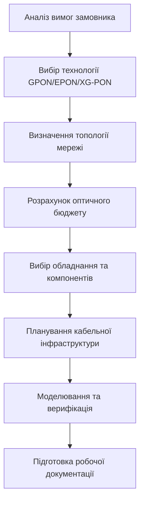
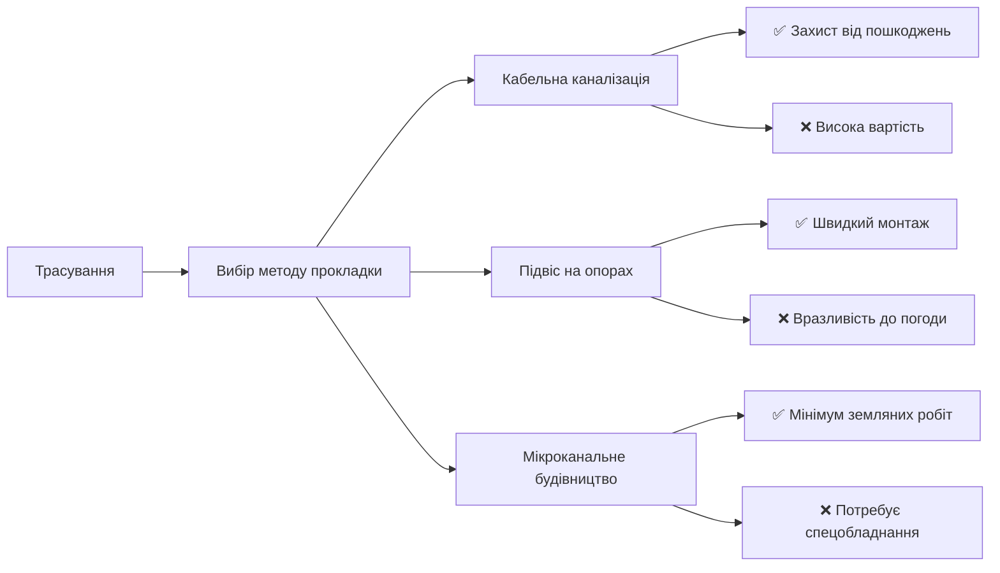

# МІНІСТЕРСТВО ОСВІТИ І НАУКИ УКРАЇНИ
## [НАЗВА ЗАКЛАДУ ВИЩОЇ ОСВІТИ]
### Кафедра телекомунікацій та мережевих технологій

---

# РЕФЕРАТ
## на тему: «Проектування пасивних оптичних мереж (PON)»

**Виконав:** студент групи [Шифр групи]  
[Прізвище та ініціали]  
**Перевірив:** [Прізвище викладача]  

**Місто — 2026**

---

## ЗМІСТ

1. [Вступ](#вступ)
2. [Етапи проектування PON-мереж](#2-етапи-проектування-pon-мереж)
3. [Вибір архітектури та топології](#3-вибір-архітектури-та-топології)
4. [Розрахунок оптичного бюджету](#4-розрахунок-оптичного-бюджету)
5. [Вибір обладнання: активні та пасивні компоненти](#5-вибір-обладнання-активні-та-пасивні-компоненти)
6. [Практичні аспекти розгортання](#6-практичні-аспекти-розгортання)
7. [Висновки](#висновки)
8. [Список використаних джерел](#список-використаних-джерел)

---

## ВСТУП

**Актуальність теми.** Стрімке зростання попиту на швидкісні послуги передачі даних, відеоконтенту у високій роздільній здатності та розвиток технологій «розумного міста» вимагають модернізації мереж доступу. Пасивні оптичні мережі (PON — Passive Optical Network) сьогодні є оптимальним рішенням для забезпечення широкополосного доступу завдяки високій пропускній здатності, енергоефективності та низьким експлуатаційним витратам.

**Мета роботи** — систематизувати знання щодо методології проектування PON-мереж, розглянути ключові етапи розрахунку параметрів, вибору обладнання та практичні аспекти впровадження технологій GPON/EPON.

**Об'єкт дослідження** — процеси проектування та побудови пасивних оптичних мереж доступу.

---

## 2. ЕТАПИ ПРОЕКТУВАННЯ PON-МЕРЕЖ

Проектування сучасної PON-мережі — це ітеративний процес, що складається з таких ключових етапів:



### 2.1. Аналіз вимог та ТЗ
На початковому етапі необхідно чітко визначити:
- **Кількість абонентів** та щільність їх розміщення;
- **Очікувані послуги**: Інтернет, IP-телефонія, IPTV, відеоспостереження;
- **Вимоги до QoS**: гарантована смуга, затримка, джиттер;
- **Масштабованість**: перспектива збільшення абонентської бази на 3–5 років;
- **Бюджет проекту**: CAPEX (капітальні витрати) та OPEX (експлуатаційні).

### 2.2. Геодезична підготовка
- Аналіз існуючої кабельної каналізації;
- Визначення місць розміщення OLT, сплітерів, муфт;
- Оцінка відстаней від центрального офісу до кінцевих абонентів.

---

## 3. ВИБІР АРХІТЕКТУРИ ТА ТОПОЛОГІЇ

### 3.1. Класифікація FTTx-архітектур

| Архітектура | Опис | Застосування |
|-------------|------|--------------|
| **FTTCab** (Fiber To The Cabinet) | Волокно до вуличної шафи, далі — мідь | Райони з низькою щільністю, тимчасові рішення |
| **FTTB** (Fiber To The Building) | Волокно до під'їзду/підвалу, далі — UTP | Багатоквартирні будинки, гуртожитки |
| **FTTH** (Fiber To The Home) | Волокно безпосередньо в квартиру | Престижне житло, новобудови, бізнес |

### 3.2. Топології PON

**Точка-мультиточка (Point-to-Multipoint)** — базова топологія PON:

```
                    ┌─ ONT₁ (абонент 1)
        OLT ──┬── Splitter ──┼─ ONT₂ (абонент 2)
              │              └─ ...
              │              ┌─ ONTₙ (абонент n)
              └─ Резервний шлях (опціонально)
```

**Критерії вибору коефіцієнта розгалуження сплітера:**

| Коефіцієнт | Переваги | Недоліки | Рекомендації |
|------------|----------|----------|--------------|
| **1:32** | ✅ Більший оптичний бюджет, простіше обслуговування | ❌ Менша кількість абонентів на порт OLT | Універсальний варіант для більшості сценаріїв |
| **1:64** | ✅ Максимальна економія портів OLT | ❌ Високі втрати (~21 дБ), вимогливість до якості з'єднань | Щільна міська забудова, FTTH |
| **1:128** | ✅ Економія на масштабі | ❌ Потребує класу оптичного бюджету C+, складне проектування | Тільки для коротких дистанцій (<10 км) |

### 3.3. Каскадне включення сплітерів

Для складних географічних умов доцільно використовувати дворівневу схему:

```
OLT ──[Магістраль]── Splitter 1:4 ──[Розподільчі лінії]── Splitter 1:8 ── ONT
                          │                        │
                     Загальні втрати:         Загальний коефіцієнт:
                     ~7 дБ + ~10.5 дБ         4 × 8 = 1:32
```

> 💡 **Перевага каскаду**: гнучкість розгортання, можливість поступового підключення абонентів.

---

## 4. РОЗРАХУНОК ОПТИЧНОГО БЮДЖЕТУ

Оптичний бюджет — фундаментальний параметр, що визначає працездатність мережі.

### 4.1. Формула розрахунку

```
P_budget ≥ L_fiber × α + N_splitter × L_split + N_conn × L_conn + N_splice × L_splice + M_margin
```

де:
- `P_budget` — доступний оптичний бюджет класу системи (дБ);
- `L_fiber` — довжина волокна (км);
- `α` — загасання у волокні (дБ/км): 0.35 дБ/км @1310 нм, 0.25 дБ/км @1490/1550 нм;
- `L_split` — втрати у сплітері (дБ);
- `L_conn` — втрати на коннекторі (0.3–0.5 дБ);
- `L_splice` — втрати на зварному з'єднанні (0.05–0.1 дБ);
- `M_margin` — запас на деградацію (3–5 дБ).

### 4.2. Класи оптичного бюджету (ITU-T G.984.2)

| Клас | Мінімальні втрати, дБ | Максимальні втрати, дБ | Дистанція, км |
|------|----------------------|----------------------|---------------|
| **Class A** | 5 | 20 | до 10 |
| **Class B** | 10 | 25 | до 20 |
| **Class B+** | 13 | 28 | до 20 |
| **Class C** | 15 | 30 | до 20 |
| **Class C+** | 17 | 32 | до 20+ |

### 4.3. Приклад розрахунку для GPON Class B+

**Вхідні дані:**
- Довжина траси: 18 км
- Сплітер: 1:64 (втрати 21 дБ)
- Коннектори: 4 шт. (0.4 дБ × 4 = 1.6 дБ)
- Зварні з'єднання: 6 шт. (0.08 дБ × 6 = 0.48 дБ)
- Запас: 3 дБ

**Розрахунок:**
```
Загальні втрати = 18 км × 0.25 дБ/км + 21 дБ + 1.6 дБ + 0.48 дБ + 3 дБ
                = 4.5 + 21 + 1.6 + 0.48 + 3
                = 30.58 дБ
```

**Висновок:** Для Class B+ (макс. 28 дБ) проект **не проходить**.  
**Рішення:** 
1. Зменшити коефіцієнт сплітера до 1:32 (втрати ~17.5 дБ) → загальні втрати ~27 дБ ✅
2. Або перейти на обладнання класу C+ (бюджет до 32 дБ) ✅

### 4.4. Додаткові фактори для врахування

- 🌡️ **Температурні втрати**: ±0.05 дБ/км при екстремальних температурах;
- 🔀 **Мікрозгини волокна**: +0.1–0.3 дБ на складних ділянках;
- 🔮 **Дисперсія**: критична для швидкостей >10 Гбіт/с на дистанціях >20 км;
- 📡 **Нелінійні ефекти**: SBS, SPM при високих потужностях передавачів.

---

## 5. ВИБІР ОБЛАДНАННЯ: АКТИВНІ ТА ПАСИВНІ КОМПОНЕНТИ

### 5.1. Активне обладнання

#### OLT (Optical Line Termination)

| Параметр | Рекомендації |
|----------|--------------|
| **Кількість портів PON** | 4–16 портів на шасі, модульна архітектура |
| **Підтримка технологій** | GPON, EPON, XG(S)-PON (для майбутньої міграції) |
| **Uplink-інтерфейси** | 10G/25G Ethernet, агрегація каналів (LACP) |
| **Резервування** | Подвійні блоки живлення, гаряча заміна модулів |
| **Управління** | Підтримка SNMP, TR-069, OMCI, веб-інтерфейс |

#### ONT/ONU (Optical Network Terminal/Unit)

```yaml
Для FTTH (квартира):
  • Інтерфейси: 4×GE, 2×POTS (телефон), Wi-Fi 6, RF-порт для TV
  • Живлення: 12В/1А, опція резервного акумулятора
  • Кріплення: настінне, компактний дизайн

Для FTTB (під'їзд):
  • Інтерфейси: 8–24×GE, uplink 10G SFP+
  • Живлення: 48В постійного струму (PoE-сумісність)
  • Кріплення: 19" стійка або настінний бокс
```

### 5.2. Пасивні компоненти

#### Оптичні сплітери (PLC — Planar Lightwave Circuit)

| Тип | Втрати, дБ | Рівномірність | Застосування |
|-----|------------|---------------|--------------|
| **1:8** | 10.5 ± 0.8 | ±0.5 дБ | Каскадні схеми, FTTB |
| **1:16** | 13.8 ± 1.0 | ±0.6 дБ | Середня щільність |
| **1:32** | 17.0 ± 1.2 | ±0.8 дБ | Універсальний |
| **1:64** | 21.0 ± 1.5 | ±1.0 дБ | Висока щільність, короткі дистанції |

> ⚠️ **Важливо**: використовувати сплітери з типом коннекторів SC/APC (зелені) для мінімізації зворотних відбиттів.

#### Кабельна інфраструктура

```yaml
Магістральні кабелі (OLT → сплітер):
  • Тип: зовнішній, броньований, з гідрозаповненням
  • Волокна: 24–144 × SMF G.652.D
  • Конструкція: центральна трубка або модульна

Розподільчі кабелі (сплітер → абонент):
  • Тип: внутрішньобудинковий, безгалогенний (LSZH)
  • Волокна: 2–12 × SMF, стрічкова конструкція
  • Діаметр: мінімальний для зручного монтажу в кабель-каналах

Дропи (остання миля):
  • Тип: flat-drop, самоносний, стійкий до УФ
  • Волокна: 1–2 × G.657.A1 (стійкі до мікрозгинів)
  • Конектори: попередньо встановлені SC/APC з захисним ковпачком
```

#### Муфти та кроси

- **Зварні муфти**: для герметизації з'єднань на вулиці (ступінь захисту ≥ IP68);
- **Оптичні кроси (ODF)**: 19" формат, модульна конструкція, маркування кожного порту;
- **Касети для сплітерів**: інтеграція сплітерів у ODF для зручного доступу.

---

## 6. ПРАКТИЧНІ АСПЕКТИ РОЗГОРТАННЯ

### 6.1. Планування трас прокладки



### 6.2. Маркування та документація

**Система маркування (приклад):**
```
OLT-01/PON-03/SPL-02/PORT-15 → ONT-APT-45
│       │       │       │          │
│       │       │       │          └─ Номер квартири
│       │       │       └─ Порт сплітера
│       │       └─ Номер сплітера
│       └─ Номер PON-порту OLT
└─ Ідентифікатор OLT
```

**Обов'язкова документація:**
- 🗺️ Топографічні плани з нанесенням трас;
- 🔌 Схеми комутації в кросах та муфтах;
- 📊 Протоколи вимірювань (OTDR, втрати, ORL);
- 📋 Паспорти на всі пасивні компоненти;
- 💾 База даних абонентів з прив'язкою до фізичної інфраструктури.

### 6.3. Тестування та введення в експлуатацію

**Етапи приймально-здавальних випробувань:**

1. **Візуальний огляд**: цілісність кабелів, якість зварювання, маркування;
2. **Вимірювання загасання**: джерело світла + power meter (двосторонній метод);
3. **OTDR-рефлектометрія**: локалізація подій, перевірка довжини, виявлення макро/мікрозгинів;
4. **Перевірка працездатності**: реєстрація ONT, тестування послуг (ping, throughput, VoIP);
5. **Документування результатів**: складання актів, оновлення GIS-системи.

### 6.4. Економічні аспекти проекту

```yaml
Структура CAPEX (орієнтовно):
  • Активне обладнання (OLT/ONT): 35–45%
  • Кабельна продукція: 25–35%
  • Пасивні компоненти: 10–15%
  • Монтажні роботи: 15–25%
  • Проектування та ПНР: 5–10%

Фактори зниження вартості:
  ✅ Масштабування на велику кількість абонентів
  ✅ Використання стандартних рішень та уніфікованих компонентів
  ✅ Оптимальний вибір коефіцієнта сплітера
  ✅ Мінімальна довжина «останньої милі»
```

---

## ВИСНОВКИ

1. **Проектування PON** — комплексний процес, що вимагає балансу між технічними вимогами, економічною доцільністю та експлуатаційною надійністю.

2. **Ключові фактори успіху**:
   - Точний розрахунок оптичного бюджету з урахуванням всіх втрат та запасів;
   - Обґрунтований вибір архітектури (FTTB vs FTTH) та коефіцієнта розгалуження;
   - Використання якісних пасивних компонентів з сертифікованими характеристиками;
   - Детальна документація та система маркування для спрощення обслуговування.

3. **Перспективи**: сучасні мережі слід проектувати з можливістю міграції на 10G-PON (XG(S)-PON) та NG-PON2 шляхом заміни лише активного обладнання, зберігаючи існуючу пасивну інфраструктуру (ODN).

4. **Практична рекомендація**: для масового розгортання в умовах України оптимальним є використання архітектури FTTB зі сплітером 1:32 та обладнанням класу B+, що забезпечує баланс вартості, покриття та якості послуг.

---

## СПИСОК ВИКОРИСТАНИХ ДЖЕРЕЛ

1. ITU-T G.984.x series. *Gigabit-capable Passive Optical Networks (GPON)*. — 2003–2008.
2. ITU-T G.982. *Optical distribution networks for passive optical networks (PON)*. — 2010.
3. IEEE 802.3ah-2004. *Carrier Sense Multiple Access with Collision Detection (CSMA/CD) Access Method and Physical Layer Specifications*. — 2004.
4. Кривошеєв В.С. *Оптичні системи передачі: навч. посібник*. — К.: НТУУ «КПІ», 2020.
5. FSAN. *GPON Deployment Guidelines*. — Full Service Access Network, 2021.
6. Huawei Technologies. *GPON Network Planning and Design Guide*. — 2022.
7. Збірник лекцій «Оптичні технології на мережі доступу». — 2026.

---
